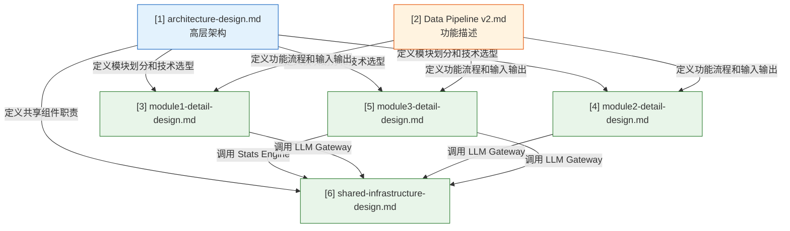

# Online EBM Pipeline — 设计文档索引

## 项目简介

本项目是一个自动化循证医学（EBM）pipeline，从用户输入的临床问题出发，自动完成文献检索、筛选、数据抽取、Meta 分析和 GRADE 评估，输出结构化的证据摘要。

---

## 文档清单

```
docs/
├── architecture-design.md           # [1] 高层架构设计
├── data-pipeline-for-online-ebm.md  # [2] 功能描述与数据流
├── module1-detail-design.md         # [3] Module 1 详细设计
├── module2-detail-design.md         # [4] Module 2 详细设计
├── module3-detail-design.md         # [5] Module 3 详细设计
└── shared-infrastructure-design.md  # [6] 共享基础设施详细设计
```

---

## 文档关系



**阅读顺序建议：** [1] → [2] → [3] → [4] → [5] → [6]

---

## 各文档内容说明

### [1] architecture-design.md — 高层架构设计

**定位：** 全局视角，定义系统的整体结构和技术决策。

**核心内容：**
- 系统定位与目标（端到端自动化、可追溯性、模块化）
- 整体架构图（Frontend / Backend / Storage 三层）
- 技术选型（Streamlit + FastAPI + Celery + ES + gpt-5.2）
- 三大模块的职责划分和依赖关系
- Pipeline Orchestrator 的状态模型和 DAG 调度
- LLM 调用策略和成本估算
- 数据流全景图
- 项目目录结构
- 部署方案（单机 → 多用户扩展）

---

### [2] data-pipeline-for-online-ebm.md — 功能描述与数据流

**定位：** 功能层面的完整描述，定义每个步骤"做什么"和"输入输出是什么"。

**核心内容：**
- 三大模块的流程图和职责概述
- 每个子步骤的 Process Overview、Input/Output Definition、Mock Input/Output
- Data Validation 方案（EBM-NLP、Q2CRBench-3、Cochrane data-rows 等 benchmark）
- Inherently Undeterminable Items（Selective reporting、Publication bias 等）
- Future Optimizations（sensitivity analysis、funnel plot、protocol 检索等）

**与详细设计的关系：** 本文档定义"做什么"，详细设计文档定义"怎么做"。

---

### [3] module1-detail-design.md — Module 1: Index Construction

**定位：** 离线批处理模块的详细实现方案。

**核心内容：**
- Step 1 OA RCT Retrieval（已完成，记录现状）
- Step 2 RCT Classification（已完成，记录现状）
- Step 3 PI Extraction — LLM prompt 设计、输入输出 schema、Batch API 策略
- Step 4 PI Normalization — 5 个子步骤（Cleaning → Concept Extraction → MeSH Mapping → Synonym Expansion → Aggregation）
- Step 5 Index Building — ES mapping、analyzer、写入策略、部署配置
- 批量处理策略、断点续跑、测试方案

**数据规模：** 初期 26,163 篇（2023~2026），后续可扩展至 PMC 全量。

---

### [4] module2-detail-design.md — Module 2: Question-to-Study

**定位：** 在线模块，从临床问题到候选文献的详细实现方案。

**核心内容：**
- Step 1 Question Expansion — PICO + eligibility + preliminary analysis plan 的 LLM 扩写
- Step 2 Query Generation — MeSH API 术语映射 + Boolean 检索式组装
- Step 3 Index Search — ES 多字段加权检索 + fallback 策略
- 模块级编排和 human-in-the-loop 介入点

---

### [5] module3-detail-design.md — Module 3: EBM Annotation and Analysis

**定位：** 在线模块，从候选文献到结构化证据输出的详细实现方案。是最复杂的模块。

**核心内容：**
- Step 1 Study Screening — 逐篇纳入/排除判断
- Step 2 Analysis Planning — 确认/修正 analysis list
- Step 3 Data Extraction — per-study × per-analysis 数值抽取（EvidenceContext: abstract + results + tables）
- Step 4 Risk of Bias — RoB 1 评估（5 域 LLM + Selective reporting 系统标记）（EvidenceContext: abstract + methods）
- Step 5 Meta-analysis Aggregation — 完整统计方法和公式（IV/MH/Peto/DL）
- Step 6 GRADE Assessment — 五域判断逻辑和规则
- 并行策略（Extraction 和 RoB 可并行）、LLM 调用量估算、测试方案

---

### [6] shared-infrastructure-design.md — 共享基础设施

**定位：** 所有模块共用的基础组件的详细实现方案。

**核心内容：**
- LLM Gateway — 统一调用接口、接口定义、内部流程
- Cache Layer — 只缓存 Module 3 的三个任务（Screening/Extraction/RoB），完整命中逻辑和失效条件
- Token & Cost Tracker — 记录字段、费用计算、聚合查询
- Rate Limiter & Retry — token bucket 限流、指数退避重试
- Stats Engine — 接口定义、支持的 effect measures 和 pooling methods、数据结构、模型自动选择

---

## 关键设计决策汇总

| 决策 | 选择 | 理由 |
|------|------|------|
| LLM 模型 | 统一 gpt-5.2 | 单一模型简化管理，通过 structured output 保证输出格式 |
| 检索引擎 | Elasticsearch 单节点 | Boolean query + 字段匹配是 ES 强项，10 万级单节点足够 |
| 统计计算 | 自研 Python (numpy + scipy) | 避免 rpy2 依赖，完全可控 |
| 同义词扩展 | 只用 MeSH API | 避免 LLM 幻觉风险 |
| PI Normalization | 规则 + API，不用 LLM | 确定性任务，规则更稳定更便宜 |
| Screening 输出 | 简单 include/exclude + rationale | 对标 Cochrane 标准做法，不做逐维度打分 |
| RoB Selective Reporting | 固定 unable_to_determine | 无 protocol/registration 数据源 |
| Cache 范围 | 只缓存 Module 3 的 Screening/Extraction/RoB | Module 1 结果本身持久化，不需要缓存层 |
| Data Extraction 输入 | 固定规则筛选段落（abstract + results + tables） | 不传全文，节省 token；不用 LLM 选段落，避免额外调用 |
| RoB 输入 | 固定规则筛选段落（abstract + methods） | 同上 |
