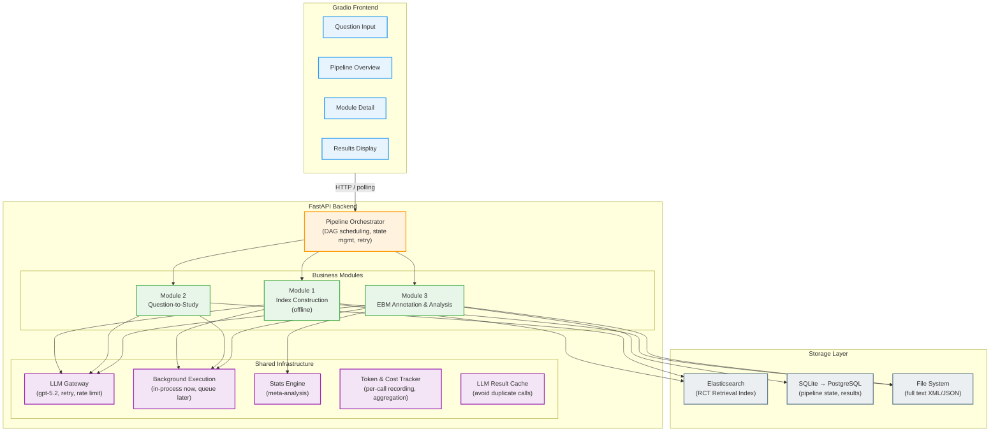
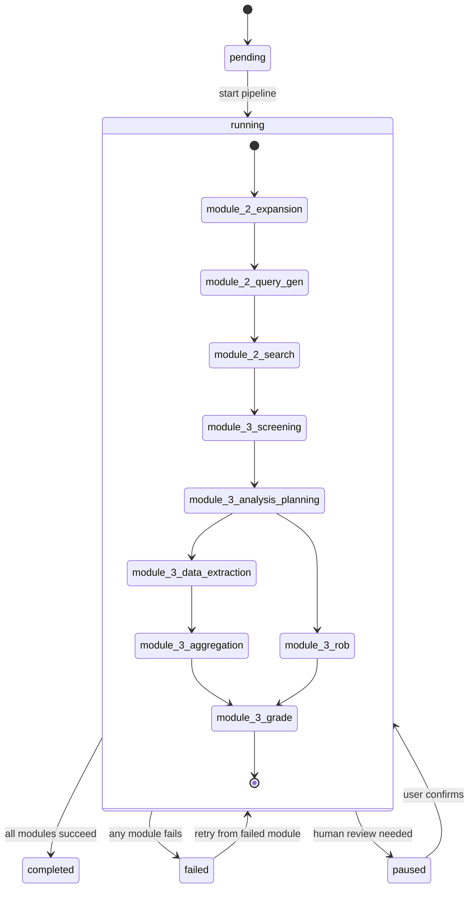
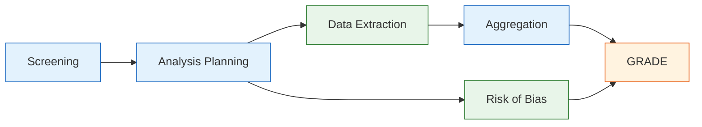
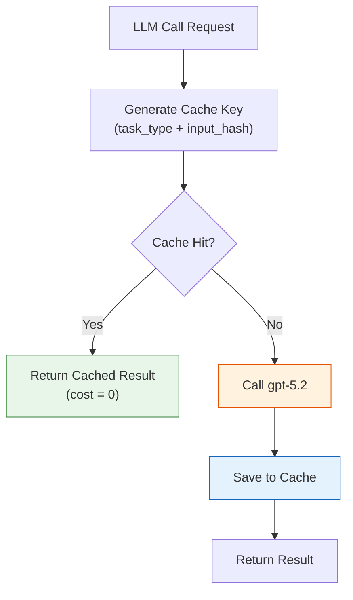
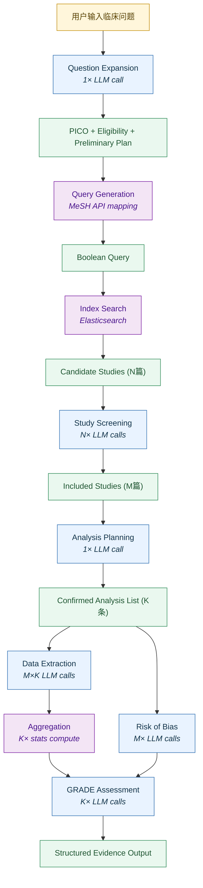
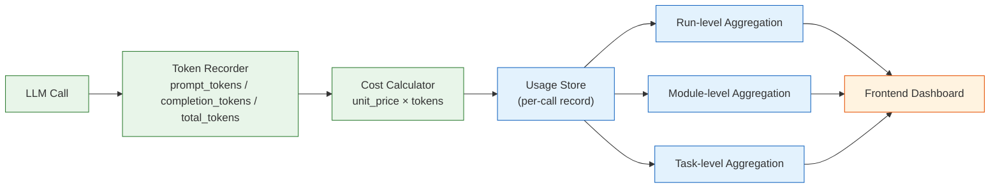

# Online EBM Pipeline — 高层架构设计方案

## 1 系统定位与目标

本系统是一个自动化循证医学（EBM）pipeline，从用户输入的临床问题出发，自动完成文献检索、筛选、数据抽取、Meta 分析和 GRADE 评估，输出结构化的证据摘要。

核心目标：
- 端到端自动化：用户输入一个医学问题，系统自动产出 Structured Evidence Output
- 可追溯性：每个 LLM 判断都保留 evidence span，支持人工审核
- 模块化：三大模块独立运行、独立测试、独立迭代
- 先单机后扩展：初期作为研究工具快速验证，架构预留水平扩展能力

## 2 整体架构



## 3 技术选型

| 层级 | 选型 | 理由 |
|------|------|------|
| 前端 | Gradio | 单页 demo 足够覆盖当前 pipeline 展示与调试需求 |
| 后端 API | FastAPI | 异步支持、自动文档、类型安全 |
| 任务调度 | 进程内后台执行（当前） | 当前简化版优先保证闭环可跑通，后续再接任务队列 |
| LLM 调用 | OpenAI SDK (gpt-5.2, configurable base_url) | 统一模型，通过 api_key + base_url 配置 |
| 检索索引 | Elasticsearch (单节点 Docker) | Boolean query + 字段匹配是 ES 强项，10 万级单节点足够 |
| 关系存储 | SQLite (初期) → PostgreSQL (扩展) | 存储 pipeline 运行状态、中间结果、审计日志 |
| 文献全文 | 本地文件系统 | PMC XML / PubMed JSON 直接存储 |
| 统计引擎 | 自研 Python 模块 (numpy + scipy) | 实现 IV/MH/Peto 方法，避免 rpy2 依赖 |
| 配置管理 | Pydantic Settings + 根目录 `.env` | 类型安全的配置，环境变量覆盖 |

## 4 模块划分与职责

### 4.1 Pipeline Orchestrator

核心调度层，负责：
- 定义模块间的 DAG 依赖关系
- 管理 pipeline 运行状态（pending → running → success/failed）
- 处理模块间数据传递
- 支持断点续跑（某个模块失败后可从该模块重新开始）
- 提供轮询式进度查询；实时推送留作后续扩展

状态模型：



Pipeline Run 数据结构：
- `run_id`: UUID
- `status`: pending | running | completed | failed | paused
- `question`: str
- `created_at`: datetime
- `modules`: 每个子模块含 {status, input, output, started_at, finished_at}
- `final_output`: StructuredEvidenceOutput | null

### 4.2 Module 1: Index Construction (离线)

这是一个离线批处理模块，不参与实时 pipeline 运行。

子任务：
1. **OA RCT Retrieval** — 从 PMC/PubMed 批量拉取 open-access 文献
2. **RCT Classification** — 规则 + LLM 分类为 primary RCT / related RCT / non-RCT
3. **PI Extraction** — LLM 提取 Population 和 Intervention
4. **PI Normalization** — 清洗、MeSH 映射、同义词扩展
5. **Index Building** — 写入 Elasticsearch

运行频率：按需（新数据入库时）或定期（如每月更新）

### 4.3 Module 2: Question-to-Study (在线)

子任务：
1. **Question Expansion** — LLM 扩写为 PICO + eligibility + preliminary analysis plan
2. **Query Generation** — P+I 映射 MeSH + free-text，生成 Boolean query
3. **Index Search** — 在 ES 中执行检索，返回候选文献

### 4.4 Module 3: EBM Annotation and Analysis (在线)

子任务（含并行关系）：
1. **Study Screening** — 逐篇判断纳入/排除（串行于 search 之后）
2. **Analysis Planning** — 确认/修正 analysis list（串行于 screening 之后）
3. **Data Extraction** — 逐篇逐 analysis 抽取数值（可并行）
4. **Risk of Bias** — 逐篇 RoB 1 评估（5 域 LLM 判断 + Selective reporting 系统标记）（可与 extraction 并行）
5. **Meta-analysis Aggregation** — 统计计算 pooled effect（依赖 extraction）
6. **GRADE Assessment** — 综合 aggregation + RoB 输出 certainty（依赖 aggregation + RoB）

并行策略：



### 4.5 Shared Infrastructure

#### LLM Gateway
- 统一的 LLM 调用接口，封装 retry、rate limiting、token 计数、cost tracking
- 统一使用 gpt-5.2，通过 api_key + base_url 配置
- Prompt 模板管理：每个子任务的 prompt 独立文件，版本化管理
- 每次调用自动记录 token 消耗和费用到 Usage Store

#### Token & Cost Tracker
- 内嵌于 LLM Gateway，每次调用自动采集 prompt_tokens / completion_tokens / latency
- 按 run_id / module / task 三级聚合
- 实时推送累计费用到前端 Dashboard
- 支持历史查询和费用趋势分析

#### LLM Result Cache

对确定性 LLM 调用结果进行缓存，避免重复调用浪费 token 和费用。

**缓存策略：**



**可缓存的任务（结果确定性高）：**

| 任务 | Cache Key 组成 | 缓存有效期 | 说明 |
|------|---------------|-----------|------|
| PI Extraction | study_id + prompt_version | 永久 | 同一篇文献的 PI 不会变 |
| RCT Classification | study_id + prompt_version | 永久 | 分类结果稳定 |
| Data Extraction | study_id + analysis_id + prompt_version | 永久 | 同一文献同一 analysis 的数值固定 |
| Risk of Bias | study_id + prompt_version | 永久 | 同一文献的 RoB 判断稳定 |
| Study Screening | study_id + pico_hash + prompt_version | 按 PICO | 同一 PICO 下对同一文献的判断稳定 |

**不缓存的任务（依赖上下文或需要灵活性）：**

| 任务 | 原因 |
|------|------|
| Question Expansion | 用户可能对同一问题有不同意图 |
| Analysis Planning | 依赖纳入文献集合，集合变则结果变 |
| GRADE Assessment | 依赖 aggregation 和 RoB 的组合结果 |

**Cache Key 设计：**

```python
import hashlib, json

def make_cache_key(task_type: str, inputs: dict, prompt_version: str) -> str:
    """生成缓存 key：task_type + 输入内容 hash + prompt 版本"""
    content = json.dumps(inputs, sort_keys=True, ensure_ascii=False)
    input_hash = hashlib.sha256(content.encode()).hexdigest()[:16]
    return f"{task_type}:{input_hash}:{prompt_version}"
```

**缓存失效条件：**
- Prompt 模板更新（prompt_version 变化）→ 自动失效
- 用户手动清除（如发现某篇文献的抽取结果有误）
- 文献全文更新（article_hash 变化）→ 自动失效

**存储方式：**
- 初期：SQLite 表 `llm_cache`（key, value_json, created_at, prompt_version）
- 扩展期：Redis 作为热缓存 + SQLite 持久化

#### Stats Engine
- 自研 Python meta-analysis 统计模块
- 支持：Fixed effect (IV, MH, Peto)、Random effect (DerSimonian-Laird)
- 输入类型：dichotomous (2x2 table)、continuous (mean/SD/N)、generic IV (effect/SE)
- 输出：pooled effect、CI、heterogeneity (chi2, I2, tau2)、Z-test

#### Storage Layer
- Elasticsearch：RCT 检索索引
- SQLite：pipeline 运行状态、中间结果 JSON
- File System：文献全文、prompt 模板、输出报告

## 5 数据流



## 6 LLM 调用策略

统一使用 `gpt-5.2`，通过 OpenAI SDK 配置 `api_key` + `base_url` 接入。

| 子任务 | 模型 | 调用次数 | 说明 |
|--------|------|----------|------|
| Question Expansion | gpt-5.2 | 1次/问题 | 深度临床推理 |
| RCT Classification | gpt-5.2 | 1次/文献 | 三分类判断 |
| PI Extraction | gpt-5.2 | 1次/文献 | 结构化抽取 |
| Query Generation | gpt-5.2 | 1次/问题 | MeSH 映射 |
| Study Screening | gpt-5.2 | 1次/候选文献 | PICO 匹配判断 |
| Analysis Planning | gpt-5.2 | 1次/问题 | 综合判断 |
| Data Extraction | gpt-5.2 | 1次/study×analysis | 数值抽取 |
| Risk of Bias | gpt-5.2 | 1次/study | 方法学判断 |
| GRADE Assessment | gpt-5.2 | 1次/evidence body | 综合推理 |

成本估算（假设一个问题召回 50 篇候选、纳入 10 篇、3 条 analysis）：
- Question Expansion: 1 call
- Query Generation: 1 call
- Screening: 50 calls
- Analysis Planning: 1 call
- Data Extraction: 30 calls (10 studies × 3 analyses)
- RoB: 10 calls
- GRADE: 3 calls
- 总计约 96 次 gpt-5.2 调用 / 问题

### 6.1 Token 与费用统计模块

每次 LLM 调用自动记录以下指标，支持按 run / module / task 三级聚合：



**记录字段（per-call）：**

| 字段 | 类型 | 说明 |
|------|------|------|
| call_id | UUID | 唯一调用标识 |
| run_id | UUID | 所属 pipeline run |
| module | str | 所属模块 (e.g. "module_3_screening") |
| task_name | str | 子任务名 (e.g. "screening_study_0001") |
| model | str | 模型名 (gpt-5.2) |
| prompt_tokens | int | 输入 token 数 |
| completion_tokens | int | 输出 token 数 |
| total_tokens | int | 总 token 数 |
| cost_usd | float | 本次调用费用（美元） |
| latency_ms | int | 响应耗时（毫秒） |
| timestamp | datetime | 调用时间 |
| success | bool | 是否成功 |

**聚合维度：**

- **Run 级别**：单次 pipeline 运行的总 token、总费用、总耗时
- **Module 级别**：每个模块（expansion / screening / extraction 等）的 token 和费用占比
- **Task 级别**：单个子任务（如某篇文献的 screening）的详细消耗

**费用计算：**

```python
# config/pricing.py
PRICING = {
    "gpt-5.2": {
        "input_per_1k": 0.XX,   # $/1K input tokens (按实际定价填入)
        "output_per_1k": 0.XX,  # $/1K output tokens
    }
}

def calculate_cost(model: str, prompt_tokens: int, completion_tokens: int) -> float:
    price = PRICING[model]
    return (prompt_tokens / 1000 * price["input_per_1k"] +
            completion_tokens / 1000 * price["output_per_1k"])
```

**前端展示：**

- Pipeline 总览页显示当前 run 的实时累计费用和 token 消耗
- 模块详情页显示该模块的费用明细（饼图：各子任务占比）
- 历史页面支持按时间范围查看费用趋势

## 7 扩展性设计

### 7.1 水平扩展预留
- 模块间通过消息队列解耦，未来可拆分为独立微服务
- 每个模块的输入输出都是 JSON schema 定义的，接口稳定
- Celery worker 可水平扩展（增加 worker 数量）

### 7.2 模型切换
- LLM Gateway 抽象层支持任意 OpenAI-compatible API
- 每个子任务可独立配置模型和参数
- 支持 A/B 测试不同模型的效果

### 7.3 索引扩展
- ES 索引支持增量更新
- 未来可加入向量检索（hybrid search）
- 支持多数据源（PMC + PubMed + 其他 OA 源）

### 7.4 Pipeline 扩展
- DAG 调度器支持动态添加新节点
- 支持条件分支（如 study count < 2 时跳过 aggregation）
- 支持人工介入点（human-in-the-loop）

## 8 项目结构

```
ebm-online/
├── config/
│   ├── settings.py          # Pydantic Settings
│   └── settings.py          # 配置代码；环境变量放根目录 .env
├── src/
│   ├── orchestrator/
│   │   ├── pipeline.py      # Pipeline DAG 定义和调度
│   │   ├── state.py         # 状态管理
│   │   └── runner.py        # 后台执行入口（当前进程内）
│   ├── modules/
│   │   ├── index/           # Module 1
│   │   │   ├── retrieval.py
│   │   │   ├── classification.py
│   │   │   ├── extraction.py
│   │   │   └── indexing.py
│   │   ├── question/        # Module 2
│   │   │   ├── expansion.py
│   │   │   ├── query_gen.py
│   │   │   └── search.py
│   │   └── analysis/        # Module 3
│   │       ├── screening.py
│   │       ├── planning.py
│   │       ├── extraction.py
│   │       ├── rob.py
│   │       ├── aggregation.py
│   │       └── grade.py
│   ├── llm/
│   │   ├── gateway.py       # LLM 调用封装 (gpt-5.2)
│   │   ├── tracker.py       # Token & Cost Tracker
│   │   ├── cache.py         # LLM Result Cache
│   │   ├── pricing.py       # 模型定价配置
│   │   ├── prompts/         # Prompt 模板目录
│   │   │   ├── expansion.txt
│   │   │   ├── screening.txt
│   │   │   └── ...
│   │   └── schemas.py       # 输出 JSON schema
│   ├── stats/
│   │   ├── meta_analysis.py # Meta-analysis 统计核心
│   │   ├── effects.py       # Effect size 计算
│   │   └── heterogeneity.py # 异质性检验
│   ├── storage/
│   │   ├── es_client.py     # Elasticsearch 客户端
│   │   ├── db.py            # SQLite/PostgreSQL
│   │   └── models.py        # ORM 模型
│   └── api/
│       ├── main.py          # FastAPI app
│       └── routes/          # API 路由
├── frontend/
│   └── gradio_app.py       # Gradio 单页入口
├── data/
│   ├── file/               # Cochrane dataPackage (已有)
│   ├── pmc/                # PMC 全文 XML
│   └── index/              # ES 索引数据
├── tests/
│   ├── unit/
│   ├── integration/
│   └── benchmarks/         # EBM-NLP, Q2CRBench 等验证
├── docs/
│   └── architecture/architecture-design.md  # 本文档
├── requirements.txt
└── README.md
```

## 9 前端设计概要

### 页面结构

**Page 1: 问题输入**
- 文本框输入临床问题
- 可选：手动指定 PICO 约束
- "开始分析" 按钮

**Page 2: Pipeline 总览**
- 流程图展示当前 pipeline 进度（哪个模块在跑、哪些已完成）
- 每个模块节点显示状态（pending/running/done/error）
- 轮询式更新

**Page 3: 模块详情**
- 点击任意模块查看该模块的输入、输出、中间过程
- 如 Screening 模块：展示每篇文献的纳入/排除决策和理由
- 如 Data Extraction：展示抽取的数值和 evidence span

**Page 4: 结果展示**
- Forest plot（每条 analysis 一张）
- GRADE Summary of Findings 表格
- RoB 汇总图（traffic light plot）
- 完整 JSON 输出下载

## 10 部署方案

### 初期（单机研究工具）
```
Elasticsearch（按需单独启动）  →  ES(9200)
uvicorn ebm_backend.online_pipeline.interfaces.api.main:app  →  Backend(8000)
python frontend/gradio_app.py  →  Frontend(7860)
```

### 扩展期（多用户 Web Service）
- Backend 部署多实例 + Nginx 负载均衡
- 后台任务队列 worker 水平扩展
- SQLite → PostgreSQL
- 加入用户认证（JWT）
- ES 集群化（如需要）

## 11 风险与缓解

| 风险 | 影响 | 缓解措施 |
|------|------|----------|
| LLM 输出不稳定 | 同一输入多次运行结果不同 | temperature=0 + structured output + 输出校验 |
| LLM 幻觉 | 抽取不存在的数值 | evidence span 强制要求 + 后验校验 |
| 检索召回不足 | 漏掉相关 RCT | 同义词扩展 + MeSH 映射 + 宽松检索策略 |
| 统计计算错误 | pooled effect 不准 | 用 Cochrane data-rows 做 regression test |
| 单次 pipeline 成本高 | ~96 次 gpt-4o 调用 | 分级模型策略 + 缓存 + batch API |
| ES 单点故障 | 索引不可用 | Docker volume 持久化 + 定期备份 |

## 12 下一步

1. 确认本架构方案的方向
2. 逐模块细化设计（接口定义、prompt 设计、数据模型）
3. 搭建项目骨架代码
4. 实现 Module 2（最快能看到端到端效果的路径）
5. 搭建前端 prototype
