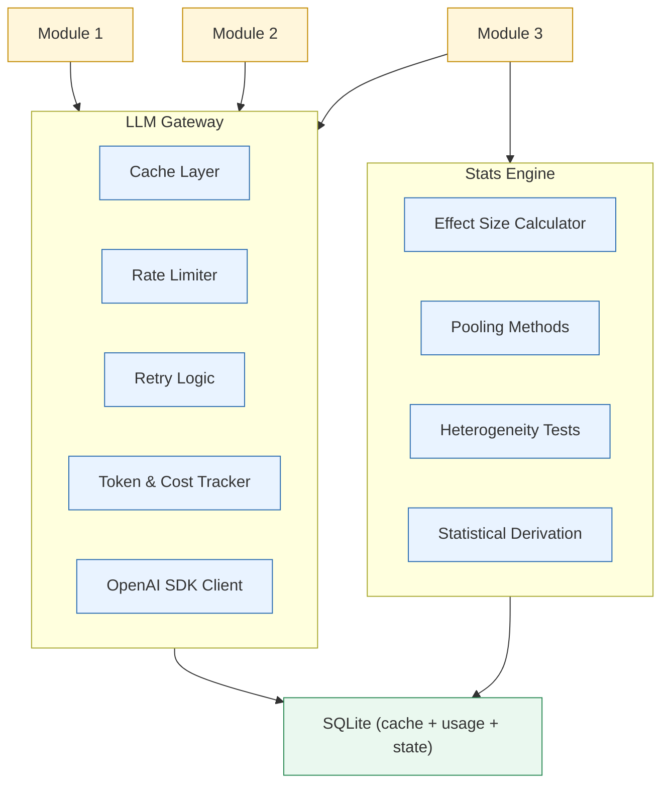
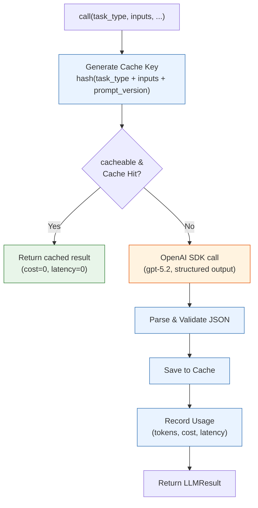
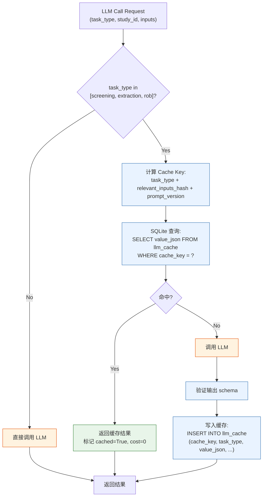

# Shared Infrastructure — 详细设计

- **Status:** reference
- **Last Reviewed:** 2026-05-15
- **Source of Truth:** Shared infrastructure design reference.


## 1 概览



共享基础设施包含两个核心组件：
- **LLM Gateway**：统一的 LLM 调用接口，Phase 1 已实现 Cache、Token Tracking、OpenAI 调用链；Rate Limiting 与 Retry 后续按需补充
- **Stats Engine**：自研 meta-analysis 统计库，Phase 1 已实现基础统计能力，供 Module 3 Aggregation 使用

---

## 2 LLM Gateway

### 2.1 职责

封装所有 LLM 调用，提供统一接口。调用方只需指定 task_type + inputs，Gateway 处理缓存、计费与结果解析；Rate Limiting 和 Retry 后续按需补充。

### 2.2 接口定义

```python
class LLMGateway:
    async def call(
        self,
        task_type: str,           # 任务类型，如 "screening", "extraction", "rob"
        inputs: dict,             # 任务输入（用于生成 cache key）
        prompt_template: str,     # prompt 模板名称
        prompt_vars: dict,        # prompt 变量
        response_schema: dict,    # 期望的 JSON schema（structured output）
        temperature: float = 0,
        cacheable: bool = True,   # 是否启用缓存
    ) -> LLMResult:
        ...

    async def call_batch(
        self,
        requests: list[LLMRequest],  # 批量请求
    ) -> list[LLMResult]:
        ...
```

**LLMResult 结构：**

```python
@dataclass
class LLMResult:
    content: dict               # 解析后的 JSON 输出
    raw_response: str           # 原始响应文本
    usage: TokenUsage           # token 消耗
    cached: bool                # 是否来自缓存
    latency_ms: int             # 响应耗时（缓存命中时为 0）
    call_id: str                # 唯一调用标识
```

### 2.3 内部流程



---

## 3 Cache Layer

### 3.1 设计思路

**什么需要缓存：** Phase 1 仅覆盖 `screening / extraction / rob` 三类任务的重复 LLM 调用。

**什么不需要缓存：**
- Module 1（PI Extraction、RCT Classification）— 离线批处理，结果直接持久化到 SQLite，不存在"重复调用"的场景
- Question Expansion、Analysis Planning、GRADE — 依赖上下文组合，每次结果不同
- Module 2 / Module 3 之外的其他任务，Phase 1 不纳入缓存范围

**缓存命中的典型场景：**

| 场景 | 命中的缓存 |
|------|-----------|
| 用户问了两个不同问题，但候选文献有重叠 | RoB（同一文献的 RoB 不随问题变化） |
| 用户修改 Analysis Plan 后重跑 | Data Extraction（未变化的 study × analysis 组合） |
| 同一 PICO 下重跑 pipeline（如修改了 GRADE 后重跑） | Screening + Extraction + RoB 全部命中 |
| Prompt 版本升级后重跑 | 全部 miss（prompt_version 变了） |

### 3.2 缓存的三个任务及命中条件

#### Study Screening

```
Cache Key = hash(study_id + pico_hash + prompt_version)
```

**命中条件：** 同一篇文献 + 同一个 PICO 定义 + 同一个 prompt 版本

**pico_hash 的计算：**
```python
def compute_pico_hash(pico: dict, eligibility: dict) -> str:
    """将 PICO + eligibility 序列化后取 hash"""
    content = json.dumps({
        "pico": pico,
        "eligibility": eligibility
    }, sort_keys=True, ensure_ascii=False)
    return hashlib.sha256(content.encode()).hexdigest()[:16]
```

**命中逻辑：**
1. 用户输入新问题 → Question Expansion 产出 PICO
2. 对每篇候选文献，计算 cache key
3. 如果该文献在之前某次 run 中已经被同样的 PICO screening 过 → 命中，直接返回 include/exclude 结果
4. 如果 PICO 有任何变化（哪怕只改了一个 outcome）→ pico_hash 不同 → miss

**失效条件：**
- PICO 变化 → 自动 miss（hash 不同）
- Prompt 版本更新 → 自动 miss
- 用户手动修改某篇文献的 screening 决策 → 清除该条缓存

---

#### Data Extraction

```
Cache Key = hash(study_id + analysis_id + evidence_content_hash + prompt_version)
```

**命中条件：** 同一篇文献 + 同一条 target_analysis + 同一份证据内容 + 同一个 prompt 版本

**evidence_content_hash 的计算：**
```python
def compute_evidence_hash(evidence_context: dict) -> str:
    """对传入 LLM 的实际文本内容取 hash，确保内容一致"""
    content = json.dumps({
        "abstract": evidence_context["abstract"],
        "results_section": evidence_context["results_section"],
        "tables": evidence_context["tables"],
    }, sort_keys=True, ensure_ascii=False)
    return hashlib.sha256(content.encode()).hexdigest()[:16]
```

**命中逻辑：**
1. Analysis Planning 产出 confirmed_analysis_list
2. 对每个 (study, analysis) 组合，计算 cache key
3. 如果该组合在之前某次 run 中已经抽取过（且文献内容没变）→ 命中
4. 如果 analysis 定义变了（比如 timepoint 从 12w 改为 24w）→ analysis_id 不同 → miss

**失效条件：**
- Analysis 定义变化 → analysis_id 不同 → 自动 miss
- 文献全文更新 → evidence_content_hash 变化 → 自动 miss
- Prompt 版本更新 → 自动 miss
- 用户手动修改抽取结果 → 清除该条缓存

**关键设计：analysis_id 的稳定性**

analysis_id 必须是基于内容的确定性 ID，而不是自增序号：
```python
def compute_analysis_id(comparison: str, outcome: str, timepoint: str, subgroup: str | None) -> str:
    """基于 analysis 内容生成稳定 ID"""
    content = f"{comparison}|{outcome}|{timepoint}|{subgroup or ''}"
    return "analysis_" + hashlib.md5(content.encode()).hexdigest()[:8]
```

这样即使 Analysis Planning 重跑，只要产出的 analysis 内容相同，ID 就相同，缓存就能命中。

---

#### Risk of Bias

```
Cache Key = hash(study_id + evidence_content_hash + prompt_version)
```

**命中条件：** 同一篇文献 + 同一份证据内容 + 同一个 prompt 版本

**命中逻辑：**
1. RoB 不依赖 PICO 或 target_analysis（只看文献本身的方法学质量）
2. 所以只要是同一篇文献，不管用户问什么问题，RoB 结果都一样
3. 跨 run 命中率最高的缓存——只要文献被纳入过一次，后续所有 run 都能命中

**失效条件：**
- 文献全文更新 → evidence_content_hash 变化 → 自动 miss
- Prompt 版本更新 → 自动 miss
- 用户手动修改 RoB 判断 → 清除该条缓存

---

### 3.3 完整命中流程



### 3.4 缓存失效 API

```python
class CacheManager:
    def invalidate_by_study(self, study_id: str):
        """清除某篇文献的所有缓存（用户手动修改后调用）"""
        DELETE FROM llm_cache WHERE study_id = ?

    def invalidate_by_prompt_version(self, task_type: str, old_version: str):
        """清除某个 prompt 版本的所有缓存（prompt 升级后调用）"""
        DELETE FROM llm_cache WHERE task_type = ? AND prompt_version = ?

    def invalidate_by_run(self, run_id: str):
        """清除某次 run 产生的所有缓存（整体重跑时调用）"""
        # 通过 run_id 关联的 call_id 找到对应 cache entries
        ...

    def get_stats(self) -> CacheStats:
        """缓存统计：总条数、命中率、各 task_type 分布"""
        ...
```

### 3.5 存储实现

```sql
CREATE TABLE llm_cache (
    cache_key TEXT PRIMARY KEY,
    task_type TEXT NOT NULL,       -- "screening" | "extraction" | "rob"
    study_id TEXT NOT NULL,        -- 便于按 study 失效
    value_json TEXT NOT NULL,      -- 缓存的 LLM 输出
    prompt_version TEXT NOT NULL,
    created_at TIMESTAMP DEFAULT CURRENT_TIMESTAMP,
    hit_count INTEGER DEFAULT 0,
    last_hit_at TIMESTAMP
);

CREATE INDEX idx_cache_task ON llm_cache(task_type);
CREATE INDEX idx_cache_study ON llm_cache(study_id);
CREATE INDEX idx_cache_prompt ON llm_cache(task_type, prompt_version);
```

### 3.6 预估命中率

| 场景 | Screening | Extraction | RoB |
|------|-----------|------------|-----|
| 首次 run | 0% | 0% | 0% |
| 同一问题重跑（修改 GRADE 后） | 100% | 100% | 100% |
| 修改 Analysis Plan 后重跑 | 100% | 部分命中 | 100% |
| 修改 PICO 后重跑 | 0% | 0% | 100%（RoB 不依赖 PICO） |
| 不同问题但文献重叠 | 0% | 0% | 100% |
| Prompt 升级后 | 0% | 0% | 0% |

---

## 4 Token & Cost Tracker

### 4.1 记录字段

```python
# SQLite 表结构
CREATE TABLE llm_usage (
    call_id TEXT PRIMARY KEY,
    run_id TEXT,                    -- 所属 pipeline run（在线模块）
    module TEXT NOT NULL,           -- "module_1_pi_extraction", "module_3_screening" 等
    task_name TEXT NOT NULL,        -- "extraction_study_0001_analysis_001"
    cache_key TEXT,                 -- 用于按 run 关联并失效缓存
    model TEXT NOT NULL DEFAULT 'gpt-5.2',
    prompt_tokens INTEGER NOT NULL,
    completion_tokens INTEGER NOT NULL,
    total_tokens INTEGER NOT NULL,
    cost_usd REAL NOT NULL,
    latency_ms INTEGER NOT NULL,
    cached BOOLEAN NOT NULL DEFAULT FALSE,
    success BOOLEAN NOT NULL DEFAULT TRUE,
    timestamp TIMESTAMP DEFAULT CURRENT_TIMESTAMP
);

CREATE INDEX idx_usage_run ON llm_usage(run_id);
CREATE INDEX idx_usage_module ON llm_usage(module);
CREATE INDEX idx_usage_cache_key ON llm_usage(cache_key);
```

### 4.2 费用计算

```python
PRICING = {
    "gpt-5.2": {
        "input_per_1m": 2.00,    # $/1M input tokens (按实际定价填入)
        "output_per_1m": 8.00,   # $/1M output tokens
        "batch_discount": 0.5,   # Batch API 50% 折扣
    }
}

def calculate_cost(
    model: str,
    prompt_tokens: int,
    completion_tokens: int,
    is_batch: bool = False
) -> float:
    price = PRICING[model]
    discount = price["batch_discount"] if is_batch else 1.0
    return (
        prompt_tokens / 1_000_000 * price["input_per_1m"] +
        completion_tokens / 1_000_000 * price["output_per_1m"]
    ) * discount
```

### 4.3 聚合查询接口

```python
class UsageTracker:
    def get_run_summary(self, run_id: str) -> RunUsageSummary:
        """单次 pipeline run 的总 token、总费用、总耗时"""
        ...

    def get_module_breakdown(self, run_id: str) -> dict[str, ModuleUsage]:
        """按模块分组的 token 和费用"""
        ...

    def get_cost_trend(self, days: int = 30) -> list[DailyCost]:
        """历史费用趋势"""
        ...
```

---

## 5 Rate Limiter & Retry

> Phase 1 不实现，后续按需评估是否补充。

### 5.1 Rate Limiter

```python
class RateLimiter:
    def __init__(
        self,
        requests_per_minute: int = 500,   # RPM 限制
        tokens_per_minute: int = 200_000, # TPM 限制
    ):
        ...

    async def acquire(self, estimated_tokens: int):
        """等待直到有可用配额"""
        ...
```

基于 token bucket 算法，按 RPM 和 TPM 双重限制。

### 5.2 Retry 策略

```python
RETRY_CONFIG = {
    "max_retries": 3,
    "base_delay_seconds": 1,
    "max_delay_seconds": 30,
    "exponential_base": 2,
    "retryable_errors": [
        "rate_limit_error",
        "timeout",
        "server_error",    # 5xx
        "connection_error",
    ],
    "non_retryable_errors": [
        "invalid_request",  # 4xx (非 429)
        "authentication_error",
    ]
}
```

指数退避：delay = min(base * 2^attempt, max_delay)

---

## 6 Stats Engine

### 6.1 职责

自研 Python meta-analysis 统计模块，供 Module 3 Step 5 (Aggregation) 调用。不依赖 R 或 rpy2。

### 6.2 接口定义

```python
class StatsEngine:
    def compute_study_effect(
        self,
        data: StudyData,
        effect_measure: EffectMeasure,
    ) -> StudyEffect:
        """计算单个 study 的 effect size 和 SE"""
        ...

    def pool_effects(
        self,
        effects: list[StudyEffect],
        method: PoolingMethod,
        model: AnalysisModel,
    ) -> PooledResult:
        """合并多个 study 的 effect"""
        ...

    def compute_heterogeneity(
        self,
        effects: list[StudyEffect],
        pooled: PooledResult,
    ) -> HeterogeneityResult:
        """计算异质性指标"""
        ...

    def derive_missing_stats(
        self,
        observed: dict,
        derivation_type: DerivationType,
    ) -> DerivedFields:
        """统计转换（CI→SD, p→SE 等）"""
        ...
```

### 6.3 支持的类型和方法

**Effect Measures:**

```python
class EffectMeasure(Enum):
    MD = "Mean Difference"
    SMD = "Standardized Mean Difference (Hedges' g)"
    RR = "Risk Ratio"
    OR = "Odds Ratio"
    HR = "Hazard Ratio"
    GIV = "Generic Inverse Variance"
```

**Pooling Methods:**

```python
class PoolingMethod(Enum):
    IV = "Inverse Variance"
    MH = "Mantel-Haenszel"
    PETO = "Peto"

class AnalysisModel(Enum):
    FIXED = "Fixed effect"
    RANDOM = "Random effects (DerSimonian-Laird)"
```

**Derivation Types:**

```python
class DerivationType(Enum):
    CI_TO_SD = "95% CI → SD"
    SE_TO_SD = "SE → SD"
    P_TO_SE = "p-value → SE"
    MEDIAN_IQR_TO_MEAN_SD = "Median + IQR → Mean + SD (Wan 2014)"
    MEDIAN_RANGE_TO_MEAN_SD = "Median + Range → Mean + SD (Hozo 2005)"
```

### 6.4 数据结构

```python
@dataclass
class StudyData:
    study_id: str
    outcome_type: str  # "continuous", "binary", "generic_iv"
    # Continuous
    exp_mean: float | None = None
    exp_sd: float | None = None
    exp_n: int | None = None
    ctrl_mean: float | None = None
    ctrl_sd: float | None = None
    ctrl_n: int | None = None
    # Binary
    exp_events: int | None = None
    ctrl_events: int | None = None
    # Generic IV
    giv_effect: float | None = None  # log scale
    giv_se: float | None = None
    # Peto
    o_e: float | None = None
    variance: float | None = None

@dataclass
class StudyEffect:
    study_id: str
    effect: float          # log scale for ratio measures
    se: float
    variance: float        # se²
    weight: float          # 1/variance (fixed effect)
    ci_low: float
    ci_high: float

@dataclass
class PooledResult:
    effect: float          # log scale for ratio measures
    effect_original: float # original scale (exp for ratio)
    se: float
    ci_low: float
    ci_high: float
    z_value: float
    p_value: float
    method: str
    model: str
    study_count: int
    total_n_exp: int
    total_n_ctrl: int

@dataclass
class HeterogeneityResult:
    q: float               # Cochran's Q
    df: int                # k-1
    p_value: float
    i2: float              # percentage
    tau2: float | None     # only for random effects
```

### 6.5 Zero-cell Correction

```python
def apply_zero_cell_correction(
    exp_events: int, exp_n: int,
    ctrl_events: int, ctrl_n: int,
    correction: float = 0.5
) -> tuple[float, float, float, float]:
    """当任一 cell = 0 时，对四格表各 cell 加 correction"""
    if exp_events == 0 or ctrl_events == 0 or \
       (exp_n - exp_events) == 0 or (ctrl_n - ctrl_events) == 0:
        return (
            exp_events + correction,
            exp_n + 2 * correction,
            ctrl_events + correction,
            ctrl_n + 2 * correction,
        )
    return (exp_events, exp_n, ctrl_events, ctrl_n)
```

### 6.6 模型自动选择

```python
def select_method_and_model(
    effects: list[StudyEffect],
    outcome_type: str,
    has_rare_events: bool,
    heterogeneity: HeterogeneityResult | None = None,
) -> tuple[PoolingMethod, AnalysisModel]:
    """根据数据特征自动选择统计方法和模型"""

    # 默认 Fixed effect
    model = AnalysisModel.FIXED

    # 如果已有异质性结果且 I² > 50%，切换为 Random
    if heterogeneity and (heterogeneity.i2 > 50 or heterogeneity.p_value < 0.10):
        model = AnalysisModel.RANDOM

    # 选择 pooling method
    if outcome_type == "continuous" or outcome_type == "generic_iv":
        method = PoolingMethod.IV
    elif outcome_type == "binary":
        if has_rare_events:
            method = PoolingMethod.PETO
        else:
            method = PoolingMethod.MH
    else:
        method = PoolingMethod.IV

    return method, model
```

### 6.7 依赖

- `numpy`：数组运算
- `scipy.stats`：正态分布 CDF/PPF（用于 p-value 和 CI 计算）
- 不依赖 `statsmodels`、`rpy2` 或任何 R 包

---

## 7 项目结构（Infrastructure 部分）

```
src/
├── llm/
│   ├── gateway.py          # LLMGateway 主类
│   ├── cache.py            # Cache Layer
│   ├── tracker.py          # Token & Cost Tracker
│   ├── rate_limiter.py     # Rate Limiter（后续按需）
│   ├── retry.py            # Retry Logic（后续按需）
│   ├── pricing.py          # 模型定价配置
│   ├── prompts/            # Prompt 模板目录
│   │   ├── pi_extraction.txt
│   │   ├── rct_classification.txt
│   │   ├── screening.txt
│   │   ├── extraction.txt
│   │   ├── rob.txt
│   │   ├── analysis_planning.txt
│   │   ├── grade.txt
│   │   └── question_expansion.txt
│   └── schemas/            # JSON Schema 定义
│       ├── pi_extraction.json
│       ├── screening.json
│       ├── extraction.json
│       ├── rob.json
│       └── grade.json
├── stats/
│   ├── engine.py           # StatsEngine 主类
│   ├── effects.py          # Effect size 计算
│   ├── pooling.py          # Pooling methods (IV, MH, Peto, DL)
│   ├── heterogeneity.py    # 异质性检验
│   ├── derivation.py       # 统计转换 (CI→SD 等)
│   └── corrections.py     # Zero-cell correction 等
└── storage/
    ├── db.py               # SQLite/PostgreSQL 连接和 migration
    └── models.py           # 表结构定义
```
