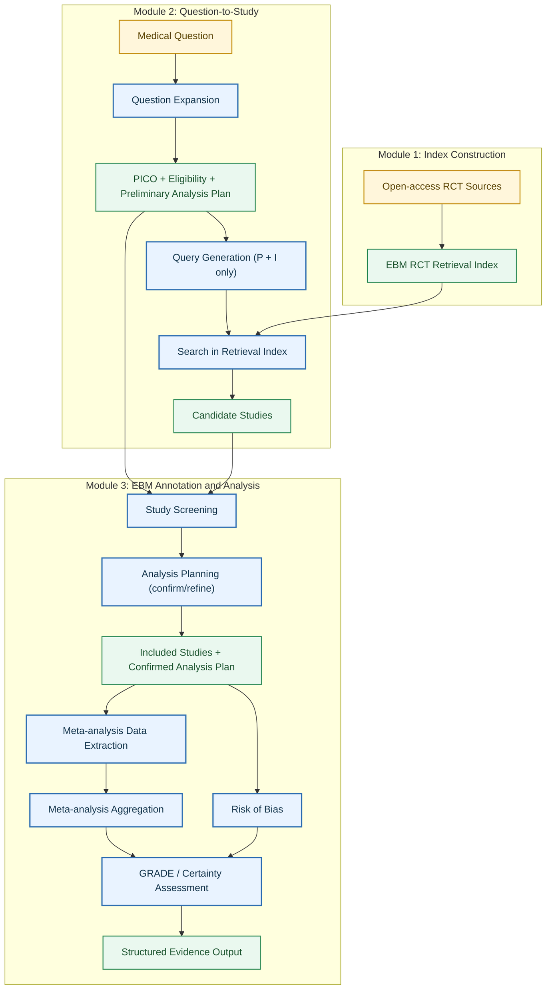
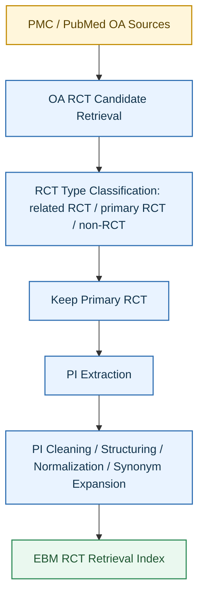
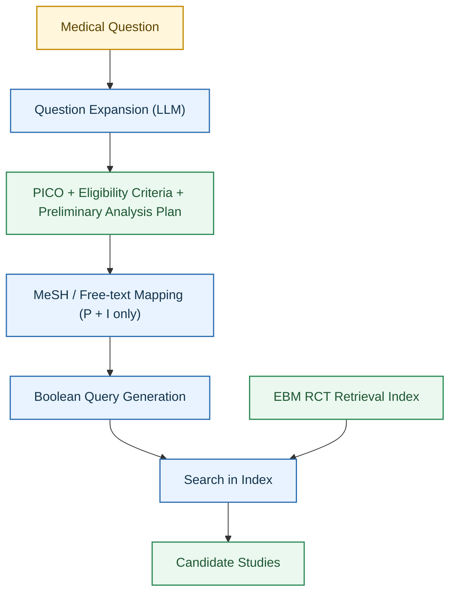
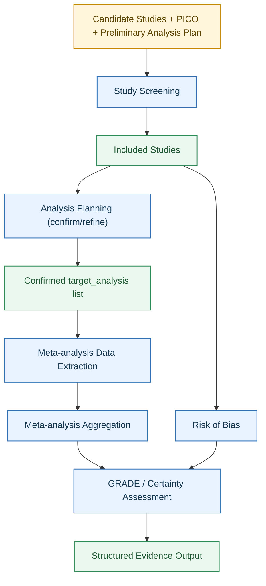

# Data Pipeline for Online EBM (v2)

- **Status:** reference
- **Last Reviewed:** 2026-05-15
- **Source of Truth:** End-to-end data flow design reference.


## 1 Overview

### 1.1 Overall Pipeline



### 1.2 Module Overview

| Module | 职责 | 核心输入 | 核心输出 |
|--------|------|----------|----------|
| Module 1: Index Construction | 构建 open-access primary RCT 的结构化检索索引 | PMC / PubMed OA 文献 | EBM RCT Retrieval Index |
| Module 2: Question-to-Study | 从医疗问题出发，经扩写和检索式生成，召回候选文献 | Medical Question | Candidate Studies + PICO + Preliminary Analysis Plan |
| Module 3: EBM Annotation and Analysis | 筛选、数据抽取、RoB、Meta 分析、GRADE 评估 | Candidate Studies + PICO + Analysis Plan | Structured Evidence Output |

### 1.3 Inherently Undeterminable Items

以下内容在当前 pipeline 中无法由自动化系统可靠判断，统一标记为 `out_of_scope` 或 `manual_review_required`：

**Risk of Bias：**
- `Selective reporting`：需要对比 trial registration/protocol 与最终发表的 outcome 列表，若无法获取 protocol 则无法判断
- `Other bias`：开放性判断，依赖 reviewer 的领域专业知识

**GRADE：**
- `Publication bias`：当前 pipeline 无法可靠判断，标记为不做

**标注规则：**
- 上述 item 在输出中统一标记为 `"judgement": "unable_to_determine"` 或 `"manual_review_required": true`
- 不影响其他可判断 domain 的正常输出

---

## 2 Module 1: Index Construction

### 2.1 Flow



### 2.2 Process Overview

流程：

- 通过 PMC 和 PubMed 接口，结合 Cochrane 风格的 RCT 检索规则，召回 open access 医学文章，形成 RCT 候选集；
- 使用正则表达式规则与 LLM as judge 将候选文章分类为 `related RCT`、`primary RCT` 和 `non-RCT`，并仅保留 `primary RCT`；
- 对保留文章使用 LLM 提取 `PI`，对抽取的 PI 原始 span 进行清洗、结构化拆解、医学概念标准化、同义词扩展和 study-level 聚合后，转化为可用于 RCT 检索匹配的结构化索引字段，并完成索引库的构建。

### 2.3 Data Scale

当前数据规模(primary)：76,135(PMC) and 26,163(2023~2026)

### 2.4 Input and Output Definition

该部分可以形式化表示为：

- 输入：检索式（由 Module 2 生成）
- 匹配方法：PI 字段匹配 + title/abstract 文本匹配 + MeSH 匹配
- 输出：与检索式匹配的结构化文献列表
- 下游用途：Study 数据抽取、Meta 分析及 GRADE

### 2.5 Mock Input and Mock Output

输入格式示例：

```json
{
  "query": "(Diabetes Mellitus, Type 2 OR type 2 diabetes OR T2DM) AND (Metformin OR metformin)",
  "source": ["PMC", "PubMed"],
  "filters": {
    "open_access": true,
    "article_type": "primary_rct"
  }
}
```

输出格式示例：

```json
{
  "query": "(Diabetes Mellitus, Type 2 OR type 2 diabetes OR T2DM) AND (Metformin OR metformin)",
  "count": 2,
  "studies": [
    {
      "study_id": "study_0001",
      "pmid": "12345678",
      "pmcid": "PMC1234567",
      "article_path": "/data/pmc/PMC1234567/full_text.xml",
      "title": "Metformin versus placebo in adults with type 2 diabetes: a randomized controlled trial",
      "population": "adults with type 2 diabetes",
      "intervention": "metformin",
      "source": "PMC"
    },
    {
      "study_id": "study_0002",
      "pmid": "23456789",
      "pmcid": "PMC2345678",
      "article_path": "/data/pubmed/PMC2345678/abstract.json",
      "title": "Metformin monotherapy for glycemic control in newly diagnosed diabetes: a randomized trial",
      "population": "newly diagnosed type 2 diabetes patients",
      "intervention": "metformin",
      "source": "PubMed"
    }
  ]
}
```

### 2.6 Data Validation (PI Extraction)

目的：验证 LLM 在 `PI` 提取任务上的效果。当前参考的 benchmark 是 `EBM-NLP`：

- benchmark: `https://github.com/bepnye/EBM-NLP`
- 任务目标：从医学摘要中识别 `Participants` 和 `Interventions`
- 数据范围：4,993 篇摘要，带有 `P/I/O` 标注

输入输出：

- 输入：单篇文献摘要文本，或对应的 token 序列
- 输出：摘要中 `Participants` 和 `Interventions` 对应的 span 标注结果

输入示例：

```json
{
  "pmid": "12345678",
  "text": "We randomized adults with persistent asthma to receive budesonide or placebo for 12 weeks.",
  "tokens": ["We", "randomized", "adults", "with", "persistent", "asthma", "to", "receive", "budesonide", "or", "placebo", "for", "12", "weeks", "."]
}
```

输出示例：

```json
{
  "pmid": "12345678",
  "participants": [
    {
      "text": "adults with persistent asthma",
      "start_token": 2,
      "end_token": 5
    }
  ],
  "interventions": [
    {
      "text": "budesonide",
      "start_token": 8,
      "end_token": 8
    },
    {
      "text": "placebo",
      "start_token": 10,
      "end_token": 10
    }
  ]
}
```

---

## 3 Module 2: Question-to-Study

### 3.1 Flow



### 3.2 Question Expansion

#### Process Overview

流程：

- 输入一个原始医疗问题；
- 由 LLM 对问题进行扩写，补全隐含的临床上下文；
- 输出结构化的 PICO、eligibility criteria 和 preliminary analysis plan。

扩写的目标是将简短、口语化的临床问题转化为完整的研究问题定义，覆盖以下维度：

- **PICO**：Population、Intervention、Comparison、Outcome
- **Eligibility criteria**：比 PICO 更细的纳入/排除条件（年龄范围、疾病严重程度、合并症限制、study design 约束等）
- **Preliminary analysis plan**：预期的 outcomes list、timepoints、effect measure 预设、感兴趣的 subgroups

对每个补充字段标注 confidence level（`high` / `medium` / `low`），`low` confidence 的字段标记为 `needs_user_confirmation`，不自动用于下游过滤。

#### Input and Output Definition

- 输入：原始医疗问题（自然语言）
- 输出1：PICO 结构化结果
- 输出2：Eligibility criteria
- 输出3：Preliminary analysis plan
- 下游用途：Query Generation（P + I 用于检索）、Study Screening（全部字段用于筛选）、Analysis Planning（preliminary plan 用于初始化）

#### Mock Input and Mock Output

输入示例：

```json
{
  "question": "在2型糖尿病成人中，二甲双胍相比安慰剂是否能降低HbA1c？"
}
```

输出示例：

```json
{
  "pico": {
    "population": ["成人2型糖尿病患者"],
    "intervention": ["二甲双胍（metformin）"],
    "comparison": ["安慰剂（placebo）"],
    "outcome": ["HbA1c 变化（change from baseline）", "空腹血糖", "低血糖事件", "体重变化"]
  },
  "eligibility_criteria": {
    "inclusion": [
      "年龄 ≥ 18 岁",
      "确诊 2 型糖尿病",
      "研究设计为 RCT"
    ],
    "exclusion": [
      "1 型糖尿病",
      "妊娠期糖尿病",
      "联合用药方案（非单药治疗）"
    ],
    "confidence": "medium"
  },
  "preliminary_analysis_plan": {
    "primary_outcome": "HbA1c change from baseline",
    "secondary_outcomes": ["fasting plasma glucose", "hypoglycaemia events", "body weight change"],
    "timepoints": ["12 weeks", "24 weeks"],
    "effect_measures": {
      "continuous": "Mean Difference (MD)",
      "binary": "Risk Ratio (RR)"
    },
    "subgroups_of_interest": ["baseline HbA1c severity", "treatment duration"],
    "confidence": "medium"
  }
}
```

### 3.3 Query Generation

#### Process Overview

流程：

- 从 Question Expansion 的输出中提取 `Population` 和 `Intervention` 字段；
- 通过 MeSH API 完成术语映射（MeSH preferred terms + entry terms）；
- 补充自由词（同义词、缩写、常见变体）；
- 用 Boolean 逻辑组合成检索式：`P AND I`（不纳入 C 和 O）。

**设计决策：** 检索式仅使用 P + I，不纳入 Comparison 和 Outcome。原因：
- C 在文献标题/摘要中表述不稳定，加入后显著降低召回率
- O 的报告方式多样，加入后会漏检大量相关 RCT
- C 和 O 的匹配判断交由 Module 3 的 Study Screening 阶段完成

#### Input and Output Definition

- 输入：Question Expansion 输出中的 `population` 和 `intervention` 字段
- 中间结果：MeSH 术语和自由词映射结果
- 输出：Boolean 检索式，作为 Module 1 Index 的查询输入
- 下游用途：在 EBM RCT Retrieval Index 中检索候选文献

#### Mock Input and Mock Output

输入（从 expansion 输出中提取 P 和 I）：

```json
{
  "population": ["成人2型糖尿病患者"],
  "intervention": ["二甲双胍（metformin）"]
}
```

MeSH / free-text 映射结果：

```json
{
  "population": {
    "mesh": ["Diabetes Mellitus, Type 2"],
    "free_text": ["type 2 diabetes", "T2DM", "type 2 diabetes mellitus"]
  },
  "intervention": {
    "mesh": ["Metformin"],
    "free_text": ["metformin", "glucophage"]
  }
}
```

最终 Boolean 检索式：

```text
("Diabetes Mellitus, Type 2" OR "type 2 diabetes" OR "T2DM" OR "type 2 diabetes mellitus")
AND
("Metformin" OR "metformin" OR "glucophage")
```

输出（面向 Module 1 Index 的检索输入）：

```json
{
  "query": "(Diabetes Mellitus, Type 2 OR type 2 diabetes OR T2DM OR type 2 diabetes mellitus) AND (Metformin OR metformin OR glucophage)",
  "source": ["PMC", "PubMed"],
  "filters": {
    "open_access": true,
    "article_type": "primary_rct"
  }
}
```

### 3.4 Data Validation (Question-level PICO)

目的：验证 LLM 在 `question-level PICO` 拆解任务上的效果。当前参考的 benchmark 是 `Q2CRBench-3`：

- benchmark: `https://huggingface.co/datasets/somewordstoolate/Q2CRBench-3`
- 任务目标：将临床问题拆解为 `P`、`I`、`C`、`O`
- 数据范围：`Clinical_Questions` 子集，共 `99` 条问题

输入输出：

- 输入：单条临床问题文本
- 输出：对应的 `PICO` 结构化结果

输入示例：

```json
{
  "question": "Should patients with dementia and agitation/aggressive behaviour be treated with atypical anti-psychotics compared to haloperidol?"
}
```

输出示例：

```json
{
  "population": "Patients with dementia and agitation/aggressive behavior",
  "intervention": "Treatment with aripripazole, zoleptil, olanzapine, quetiapin, risperidone or clozapine",
  "comparison": ["Haloperidol"],
  "outcome": [
    "Mortality",
    "Agitation/Aggression",
    "Global cognitive function",
    "Serious adverse events",
    "Caregiver burden"
  ]
}
```

---

## 4 Module 3: EBM Annotation and Analysis

### 4.1 Flow



**流程依赖说明：**
- Study Screening 和 Analysis Planning 是串行的（planning 需要知道纳入了哪些文献）
- Data Extraction 和 Risk of Bias 可以并行（都只需要单篇文献全文）
- GRADE 同时接收 Aggregation 结果和 RoB 结果，内部完成 risk of bias domain 判断

### 4.2 Study Screening

#### Process Overview

流程：

- 输入来自 Module 2 的候选文献列表，以及 Question Expansion 产出的完整 PICO 和 eligibility criteria；
- 使用 LLM 对每篇文献进行纳入/排除判断，依据：PICO 匹配度（重点是 C 和 O 的匹配，因为 P 和 I 已在检索阶段过滤）、eligibility criteria、研究设计类型；
- 输出通过筛选的文献列表，供后续 Analysis Planning 和数据抽取使用。

#### Input and Output Definition

- 输入1：Question Expansion 产出的 `PICO` + `eligibility_criteria`
- 输入2：来自 Module 1 Index 的候选文献列表
- 处理单元：对单篇文献进行 study-level 纳入/排除判断
- 输出：带有纳入/排除标签及理由的文献列表
- 下游用途：进入 Analysis Planning 和后续数据抽取流程

#### Mock Input and Mock Output

输入示例：

```json
{
  "pico": {
    "population": ["adults with type 2 diabetes"],
    "intervention": ["metformin"],
    "comparison": ["placebo"],
    "outcome": ["HbA1c change from baseline", "fasting plasma glucose", "hypoglycaemia events"]
  },
  "eligibility_criteria": {
    "inclusion": ["age >= 18", "confirmed T2DM diagnosis", "RCT design"],
    "exclusion": ["type 1 diabetes", "gestational diabetes", "combination therapy"]
  },
  "studies": [
    {
      "study_id": "study_0001",
      "pmid": "12345678",
      "title": "Metformin versus placebo in adults with type 2 diabetes: a randomized controlled trial",
      "abstract": "Adults with type 2 diabetes were randomized to receive metformin or placebo. HbA1c was assessed at 24 weeks."
    },
    {
      "study_id": "study_0002",
      "pmid": "23456789",
      "title": "Metformin for glycemic control in adolescents with diabetes",
      "abstract": "Adolescents with diabetes received metformin in an open-label comparative study."
    }
  ]
}
```

输出示例：

```json
{
  "screening_results": [
    {
      "study_id": "study_0001",
      "decision": "include",
      "rationale": "Population (adults with T2DM), intervention (metformin), comparison (placebo), and outcome (HbA1c) all match PICO criteria. RCT design confirmed."
    },
    {
      "study_id": "study_0002",
      "decision": "exclude",
      "rationale": "Population mismatch: study enrolled adolescents, not adults (age >= 18 criterion not met)."
    }
  ]
}
```

#### Data Validation (Study Screening)

目的：验证 LLM 在 `study screening` 任务上的效果。当前参考的 benchmark 是 `Q2CRBench-3` 的 `Screened_Records` 子集：

- benchmark: `https://huggingface.co/datasets/somewordstoolate/Q2CRBench-3`
- 任务目标：给定 `PICO_IDX` 对应的问题定义与一条候选文献 record，预测该 record 的 `Full-text_Assessment`
- 数据范围：`Screened_Records` 子集，共 `16,321` 条 screened records

### 4.3 Analysis Planning (confirm/refine)

#### Process Overview

流程：

- 输入来自 Study Screening 的纳入文献列表，以及 Question Expansion 阶段产出的 preliminary analysis plan；
- 结合纳入文献的实际情况（报告了哪些 outcome、哪些 timepoint、数据是 binary 还是 continuous），对 preliminary plan 进行确认或修正；
- 输出 confirmed target_analysis list，每条 target_analysis 明确定义一个具体的分析单元。

**设计决策：** 该步骤是显式的，而非隐含在 Data Extraction 中。原因：
- 一个临床问题通常对应多条 analysis（不同 outcome、不同 timepoint）
- effect_measure 的选择可能需要根据纳入文献的实际报告情况调整
- 明确的 analysis plan 使下游 Data Extraction 和 Aggregation 的输入定义更清晰

#### Input and Output Definition

- 输入1：`preliminary_analysis_plan`（来自 Question Expansion）
- 输入2：纳入文献列表及其摘要/结果概要
- 处理单元：对 preliminary plan 中的每条预设 analysis 进行可行性确认
- 输出：`confirmed_analysis_list`，每条包含 comparison、outcome、effect_measure、timepoint、subgroup（如适用）
- 下游用途：作为 4.4 Data Extraction 和 4.6 Aggregation 的 target_analysis 输入

#### Mock Input and Mock Output

输入示例：

```json
{
  "preliminary_analysis_plan": {
    "primary_outcome": "HbA1c change from baseline",
    "secondary_outcomes": ["fasting plasma glucose", "hypoglycaemia events", "body weight change"],
    "timepoints": ["12 weeks", "24 weeks"],
    "effect_measures": {
      "continuous": "Mean Difference (MD)",
      "binary": "Risk Ratio (RR)"
    },
    "subgroups_of_interest": ["baseline HbA1c severity"]
  },
  "included_studies_summary": [
    {
      "study_id": "study_0001",
      "reported_outcomes": ["HbA1c change", "fasting glucose", "body weight"],
      "reported_timepoints": ["24 weeks"],
      "outcome_data_type": {"HbA1c change": "continuous", "fasting glucose": "continuous", "body weight": "continuous"}
    },
    {
      "study_id": "study_0003",
      "reported_outcomes": ["HbA1c change", "hypoglycaemia events"],
      "reported_timepoints": ["12 weeks", "24 weeks"],
      "outcome_data_type": {"HbA1c change": "continuous", "hypoglycaemia events": "binary"}
    }
  ]
}
```

输出示例：

```json
{
  "confirmed_analysis_list": [
    {
      "analysis_id": "analysis_001",
      "comparison": "metformin vs placebo",
      "outcome": "HbA1c change from baseline",
      "effect_measure": "Mean Difference (MD)",
      "timepoint": "24 weeks",
      "subgroup": null,
      "status": "confirmed",
      "note": "Both included studies report this outcome at 24 weeks as continuous data"
    },
    {
      "analysis_id": "analysis_002",
      "comparison": "metformin vs placebo",
      "outcome": "hypoglycaemia events",
      "effect_measure": "Risk Ratio (RR)",
      "timepoint": "12 weeks",
      "subgroup": null,
      "status": "confirmed",
      "note": "Only study_0003 reports this; single-study analysis"
    },
    {
      "analysis_id": "analysis_003",
      "comparison": "metformin vs placebo",
      "outcome": "fasting plasma glucose",
      "effect_measure": "Mean Difference (MD)",
      "timepoint": "24 weeks",
      "subgroup": null,
      "status": "confirmed",
      "note": "Reported in study_0001"
    }
  ]
}
```

### 4.4 Meta-analysis Data Extraction

#### Process Overview

流程：

- 输入来自 4.2 Study Screening 的纳入文献，以及 4.3 确认的 `target_analysis`；
- 对单篇 RCT，定位与该 `target_analysis` 对应的结果语境，完成 intervention arm、control arm、outcome、timepoint 和 subgroup 的对齐；
- 从 `abstract`、`results`、表格或正文中仅抽取可直接从原文观察到、可写入 `analysis-data` row 的字段，并为每个字段保留可追溯的 evidence span；
- 当文章报告多个 subgroup 时，由 LLM 判断哪个 subgroup 对应当前 target_analysis，并标注匹配依据；
- 不在该步骤生成 pooled result、study weight，或任何需要跨 study 聚合的结果；
- 输出 single-study / single-analysis 级别的 `study_row_candidate`，供后续 meta-analysis aggregation 使用。

#### Input and Output Definition

- 输入1：`target_analysis`（来自 4.3 confirmed_analysis_list）
- 输入2：EvidenceContext — 按固定规则从全文预筛选的相关段落（abstract + results section + tables）
- 处理单元：单篇 study 在单个 `target_analysis` 下的数据抽取
- 输出：`study_row_candidate`，包含 `row_metadata`、`observed_fields`、字段级 `evidence_spans` 与 `missing_fields`
- 明确不输出：跨 study pooled result、study weight，以及仅由统计公式派生但原文未显式给出的字段（如从 CI 反推的 SD，交由 4.6 Aggregation 处理）
- 下游用途：作为 4.6 Meta-analysis Aggregation 的输入

#### Mock Input and Mock Output

输入示例：

```json
{
  "target_analysis": {
    "analysis_id": "analysis_001",
    "comparison": "metformin vs placebo",
    "outcome": "HbA1c change from baseline",
    "effect_measure": "Mean Difference (MD)",
    "timepoint": "24 weeks"
  },
  "study": {
    "study_id": "study_0001",
    "pmid": "12345678",
    "title": "Metformin versus placebo in adults with type 2 diabetes: a randomized controlled trial",
    "abstract": "Adults with type 2 diabetes were randomized to receive metformin or placebo for 24 weeks.",
    "results_section": "At week 24, mean HbA1c decreased by 1.2 (SD 0.6) in the metformin group and by 0.4 (SD 0.5) in the placebo group. Group sizes were 60 and 58, respectively.",
    "full_text": "<optional full text when available>"
  }
}
```

输出示例：

```json
{
  "study_id": "study_0001",
  "target_analysis_id": "analysis_001",
  "row_metadata": {
    "comparison": "metformin vs placebo",
    "outcome": "HbA1c change from baseline",
    "effect_measure": "Mean Difference (MD)",
    "outcome_type": "continuous",
    "timepoint": "24 weeks",
    "arm_mapping": {
      "experimental": "metformin",
      "control": "placebo"
    }
  },
  "observed_fields": {
    "Experimental mean": 1.2,
    "Experimental SD": 0.6,
    "Experimental N": 60,
    "Control mean": 0.4,
    "Control SD": 0.5,
    "Control N": 58
  },
  "evidence_spans": {
    "Experimental mean": "mean HbA1c decreased by 1.2",
    "Experimental SD": "SD 0.6",
    "Experimental N": "Group sizes were 60 and 58",
    "Control mean": "by 0.4 in the placebo group",
    "Control SD": "SD 0.5",
    "Control N": "Group sizes were 60 and 58"
  },
  "missing_fields": []
}
```

#### Data Validation (Meta-analysis Data Extraction)

**Benchmark 1: llm-meta-analysis**

- benchmark: `https://github.com/hyesunyun/llm-meta-analysis`
- 任务目标：给定单个 `ICO` 三元组，以及对应 RCT 的 `abstract + results section`，抽取可直接用于 meta-analysis 的数值结果
- 子任务1：`outcome_type`，判断 outcome 属于 `binary` 或 `continuous`
- 子任务2：`binary_outcomes`，抽取 `2x2 contingency table`
- 子任务3：`continuous_outcomes`，抽取 `mean`、`standard deviation` 和 `group size`
- 数据范围：dev set 共 `10` 篇 RCT、`43` 个 `ICO` triplets；test set 共 `110` 篇 RCT、`656` 个 `ICO` triplets

**Benchmark 2: Cochrane data-rows**

- 数据来源：Cochrane SR 中的 `PICO` + 单篇 RCT `full_text` + `data-rows.csv`
- 输入：模拟 `Question-level PICO` 的 SR `PICO` + 单篇 RCT 的文本证据
- 输出：模型从文本中抽取出的、可直接从原文观察到的 meta-analysis 可用字段
- 评分：只评测对应 `data-rows` 中非空、且可从文本证据追溯的直接观察字段

候选字段来自 `data-rows` 中可由原文直接支持的真实列：`Experimental mean`、`Experimental SD`、`Experimental N`、`Control mean`、`Control SD`、`Control N`、`Experimental cases`、`Control cases`、`GIV Mean`、`GIV SE`、`O-E`、`Variance`（仅当原始 study 显式报告）。

### 4.5 Risk of Bias

#### Process Overview

- 输入来自 4.2 Study Screening 的纳入 RCT，以及该 study 的全文文本证据；
- 对单篇 RCT，按 `RoB 1` 逐域给出 judgement，并保留支持判断的文本证据；
- `Selective reporting`：当前版本固定输出 `unable_to_determine`，无 protocol/registration 数据源；
- `Other bias`：若无法从原文获取充分证据，标记为 `"judgement": "unable_to_determine"`；
- 输出 study-level 的结构化 risk of bias 结果，供后续 RoB-weighted Summary 和 GRADE 使用。

**RoB 1 七域：**
- `Random sequence generation`
- `Allocation concealment`
- `Blinding of participants and personnel`
- `Blinding of outcome assessment`
- `Incomplete outcome data`
- `Selective reporting` — 需要 protocol 对比，无 protocol 时标记为 `unable_to_determine`
- `Other bias` — 开放性判断，无明确证据时标记为 `unable_to_determine`

#### Input and Output Definition

- 输入：EvidenceContext — 按固定规则从全文预筛选的相关段落（abstract + methods section）
- 处理单元：单篇 study 的 `RoB 1` 评估（5 域 LLM 判断 + Selective reporting 系统标记）
- 输出：该 study 在各个 bias domain 上的 `judgement` 与 `support`
- judgement 标签：`Low risk`、`High risk`、`Unclear risk`、`unable_to_determine`
- 下游用途：进入 RoB-weighted Summary，并最终用于 GRADE 评估

#### Mock Input and Mock Output

输入示例：

```json
{
  "study": {
    "study_id": "study_0003",
    "pmid": "34567890",
    "title": "Metformin versus placebo in adults with type 2 diabetes: a randomized controlled trial",
    "methods_section": "Participants were randomly assigned using a computer-generated sequence. Allocation was concealed with sealed opaque envelopes. Outcome assessors were blinded. The trial was open-label for participants and treating clinicians.",
    "results_section": "Five participants in the intervention group and one in the control group were lost to follow-up. Reasons for withdrawal were reported.",
    "full_text": "<full text when available>"
  }
}
```

输出示例：

```json
{
  "study_id": "study_0003",
  "rob_framework": "RoB 1",
  "risk_of_bias": [
    {
      "domain": "Random sequence generation",
      "judgement": "Low risk",
      "support": "Quote: \"Participants were randomly assigned using a computer-generated sequence.\""
    },
    {
      "domain": "Allocation concealment",
      "judgement": "Low risk",
      "support": "Quote: \"Allocation was concealed with sealed opaque envelopes.\""
    },
    {
      "domain": "Blinding of participants and personnel",
      "judgement": "High risk",
      "support": "Comment: The trial was open-label for participants and treating clinicians."
    },
    {
      "domain": "Blinding of outcome assessment",
      "judgement": "Low risk",
      "support": "Quote: \"Outcome assessors were blinded.\""
    },
    {
      "domain": "Incomplete outcome data",
      "judgement": "Unclear risk",
      "support": "Comment: Attrition was imbalanced across groups (5 vs 1), although reasons for withdrawal were reported."
    },
    {
      "domain": "Selective reporting",
      "judgement": "unable_to_determine",
      "support": "Comment: No protocol or trial registration was identified; cannot assess selective reporting."
    },
    {
      "domain": "Other bias",
      "judgement": "unable_to_determine",
      "support": "Comment: Insufficient information to assess other sources of bias."
    }
  ]
}
```

#### Data Validation (Risk of Bias)

数据来源：

- 输入文本：单篇 RCT 的 `full_text`
- Ground truth 1：`cleaned/cleaned_sr/*.json` 中 `characteristics_of_studies.included[*].risk_of_bias`
- Ground truth 2：`cleaned/data_package/{zip|rm5}/*/study-data/*-risk-of-bias.csv`

评分方式：

- 主指标：domain-level 三分类 accuracy（仅评测非 `unable_to_determine` 的 domain）
- 辅指标1：`High risk` vs `Non-high risk` 二分类 accuracy
- 辅指标2：support 是否能在原文中定位到可追溯证据

### 4.6 Meta-analysis Aggregation

#### Process Overview

- 输入来自 4.4 的 `study_row_candidate`，以及 4.3 确认的 `target_analysis`；
- 对属于同一 analysis 的 study rows 做对齐与预检，检查 comparison、outcome、effect measure、单位、timepoint 和方向是否可合并；
- **统计转换**：当原文未直接报告 SD 但报告了 CI 或 p-value 时，使用统计公式从已有字段派生 SD、SE 等（此步骤在 4.4 中不执行，统一在此处完成）；
- **Subgroup 匹配**：当 4.4 抽取了多个 subgroup 的数据时，根据 target_analysis 中指定的 subgroup 定义，由 LLM 或规则匹配决定使用哪组数据；
- 使用统计库从 `observed_fields`（含派生字段）生成 single-study effect、variance 和 weight，并进一步得到 pooled effect、CI、P value 和 heterogeneity；
- 输出 analysis-level 的 aggregation result，供后续 RoB-weighted Summary 和 GRADE 使用。

#### Input and Output Definition

- 输入1：`target_analysis`（来自 4.3）
- 输入2：同一 analysis 下的 `study_row_candidate` 列表（来自 4.4）
- 处理单元：单个 `analysis`
- 输出1：`study_rows_used`（通过对齐和质检后纳入计算的 rows）
- 输出2：`derived_study_effects`（由统计库生成的 single-study effect 和 variance）
- 输出3：`overall_result`（该 analysis 的 pooled result）
- 明确不输出：新的文本抽取证据或字段级 evidence spans
- 下游用途：进入 RoB-weighted Summary 和 GRADE 流程

study-level 输入的三种形态：

- `dichotomous outcome`：`Experimental cases / Experimental N / Control cases / Control N`
- `continuous outcome`：`Experimental mean / Experimental SD / Experimental N / Control mean / Control SD / Control N`
- `generic inverse variance`：`GIV Mean / GIV SE`，或 `O-E / Variance`

#### Mock Input and Mock Output

输入示例：

```json
{
  "target_analysis": {
    "analysis_id": "analysis_001",
    "comparison": "bupropion vs placebo/no pharmacological treatment",
    "outcome": "Smoking cessation",
    "effect_measure": "Risk Ratio",
    "analysis_model": "Fixed effect"
  },
  "study_row_candidates": [
    {
      "study_id": "Ahluwalia 2002",
      "observed_fields": {
        "Experimental cases": 37,
        "Experimental N": 300,
        "Control cases": 19,
        "Control N": 300
      }
    },
    {
      "study_id": "Anthenelli 2016",
      "observed_fields": {
        "Experimental cases": 330,
        "Experimental N": 2034,
        "Control cases": 191,
        "Control N": 2035
      }
    }
  ]
}
```

输出示例：

```json
{
  "analysis_id": "analysis_001",
  "study_rows_used": [
    {"study_id": "Ahluwalia 2002", "included_in_pool": true},
    {"study_id": "Anthenelli 2016", "included_in_pool": true}
  ],
  "derived_study_effects": [
    {"study_id": "Ahluwalia 2002", "effect_measure": "Risk Ratio", "log_effect": 0.666479, "variance": 0.072992},
    {"study_id": "Anthenelli 2016", "effect_measure": "Risk Ratio", "log_effect": 0.547311, "variance": 0.007283}
  ],
  "overall_result": {
    "effect_measure": "Risk Ratio",
    "analysis_model": "Fixed effect",
    "pooled_effect": 1.747388,
    "ci_low": 1.489774,
    "ci_high": 2.04955,
    "study_count": 2,
    "experimental_cases": 367,
    "experimental_n": 2334,
    "control_cases": 210,
    "control_n": 2335,
    "heterogeneity_chi2": 0.176906,
    "heterogeneity_df": 1,
    "heterogeneity_p": 0.674046,
    "heterogeneity_i2": 0.0,
    "effect_z": 6.85852,
    "effect_p": 0.0
  }
}
```

#### Data Validation (Meta-analysis Aggregation)

数据来源：

- Ground truth input：`cleaned/data_package/{zip|rm5}/*/analysis-data/*-data-rows.csv`
- Ground truth output：`cleaned/data_package/{zip|rm5}/*/analysis-data/*-overall-estimates-and-settings.csv`
- 可用数据：`445` 个 review 同时含有 data-rows、overall-estimates 和 cleaned_sr PICO

评分方式：

- 主指标：`pooled_effect`、`CI_low`、`CI_high` 的数值一致性
- 辅指标1：`heterogeneity_chi2`、`heterogeneity_p`、`heterogeneity_i2` 的数值一致性
- 辅指标2：`study_count`、`experimental_n`、`control_n` 等聚合字段的一致性

说明：最终数值结果应由统计库生成，LLM 不应直接生成或改写 pooled 数值。

### 4.7 GRADE / Certainty Assessment

#### Process Overview

流程：

- 输入来自 4.6 的 overall meta-analysis result、4.5 的 study-level RoB judgement，以及 Question Expansion 产出的 PICO；
- 对单条 evidence body 逐 domain 做直接判断：
  - `risk of bias`：统计 contributing studies 中 high-RoB 和 unclear-RoB 的数量占比，判断是否 downgrade
  - `inconsistency`：基于 heterogeneity I² 和 chi² p-value 判断
  - `imprecision`：基于 CI 是否跨越 null effect 和临床意义阈值判断
  - `indirectness`：基于 PICO 对齐（P/I/C/O 匹配性）做 proxy assessment
  - `publication bias`：标记为 `unable_to_determine`，当前版本不做此项判断
- 输出 `partial GRADE draft`，明确标记 `manual_review_required`。

#### Input and Output Definition

- 输入1：`target_evidence_body`（comparison + outcome）
- 输入2：来自 4.6 的 `overall_result`（含 pooled_effect、CI、heterogeneity）
- 输入3：来自 4.5 的各 study 的 `risk_of_bias` judgement
- 输入4：`Question-level PICO`（用于 indirectness proxy assessment）
- 处理单元：单条 outcome-level evidence body
- 输出：`supported_domain_assessments`、`unresolved_domains`、`manual_review_required`、`provisional_overall_certainty`、`rationale_text`
- 下游用途：生成或辅助补全 Summary of Findings

#### Mock Input and Mock Output

输入示例：

```json
{
  "question_pico_proxy": {
    "population": ["people who smoke"],
    "intervention": ["bupropion"],
    "comparison": ["placebo/no pharmacological treatment"],
    "outcome": ["Serious adverse events"]
  },
  "target_evidence_body": {
    "comparison": "bupropion vs placebo/no pharmacological treatment",
    "outcome": "Serious adverse events"
  },
  "overall_result": {
    "effect_measure": "Risk Ratio",
    "pooled_effect": 1.16,
    "ci_low": 0.90,
    "ci_high": 1.48,
    "study_count": 23,
    "experimental_n": 10958,
    "heterogeneity_i2": 0.0,
    "heterogeneity_p": 0.85
  },
  "study_rob_judgements": [
    {"study_id": "study_001", "overall_rob": "Low risk"},
    {"study_id": "study_002", "overall_rob": "Low risk"},
    {"study_id": "study_003", "overall_rob": "High risk"},
    {"study_id": "study_004", "overall_rob": "Unclear risk"}
  ]
}
```

输出示例：

```json
{
  "grade_assessment_draft": {
    "supported_domain_assessments": {
      "risk_of_bias": {
        "judgement": "not serious",
        "rationale": "3/23 studies at high risk of bias; majority of evidence is at low risk."
      },
      "inconsistency": {
        "judgement": "not serious",
        "rationale": "I² = 0%, chi² p = 0.85; no evidence of heterogeneity."
      },
      "indirectness": {
        "judgement": "not serious",
        "rationale": "Population, intervention, comparison, and outcome directly match the target question PICO."
      },
      "imprecision": {
        "judgement": "serious",
        "rationale": "CI crosses null (0.90–1.48); cannot exclude no difference or clinically important harm."
      },
      "publication_bias": {
        "judgement": "unable_to_determine",
        "rationale": "Publication bias assessment is out of scope for the current pipeline."
      }
    },
    "unresolved_domains": ["publication_bias"],
    "manual_review_required": true,
    "provisional_overall_certainty": "Moderate",
    "rationale_text": "Downgraded one level for imprecision because the confidence interval includes no difference and important harm cannot be excluded."
  }
}
```

#### Data Validation (GRADE / Certainty Assessment)

数据来源：

- Ground truth output：`cleaned/cleaned_sr/*.json` 中的 `summary_of_findings`
- 可用数据：`506` 个 review 含有 `summary_of_findings`，其中 `393` 个含有可解析的脚注标记

评分方式：

- 主指标：`risk of bias / inconsistency / indirectness / imprecision` 四类 supported domains 的匹配准确率
- 辅指标1：`provisional_overall_certainty` 对 `High / Moderate / Low / Very low` 的一致性
- 辅指标2：`rationale_text` 是否覆盖 SoF footnotes 中的核心理由

说明：

- `publication bias` 标记为 `unable_to_determine`，不纳入评分
- `provisional_overall_certainty` 只作为弱监督辅助指标
- 本节输出为 `partial GRADE draft`，不替代人工最终 GRADE certainty

---

## 5 Future Optimizations

以下为当前版本中已讨论但暂不实现的增强方向，供后续迭代参考。

### 5.1 GRADE Risk of Bias Domain — Sensitivity Analysis

**当前实现：** 统计 high-RoB studies 的数量占比，直接判断是否 downgrade。

**优化方向：** 参考 GRADE 官方方法（[GRADE guidelines 4](https://www.jclinepi.com/article/S0895-4356(10)00413-0/fulltext)），在 GRADE 内部增加以下逻辑：

1. 从 Aggregation 结果中获取每个 study 的 weight
2. 计算 high-RoB studies 在 pooled estimate 中的权重占比（而非仅数量占比）
3. 做 sensitivity analysis：去掉 high-RoB studies 后重新计算 pooled estimate
4. 比较去掉前后的结果差异（方向是否改变、显著性是否改变），据此判断是否 downgrade

**预期收益：** 更准确地反映 high-RoB studies 对结论的实际影响，避免"数量多但权重小"的 high-RoB studies 导致误判。

### 5.2 GRADE Publication Bias — Funnel Plot + Egger's Test

**当前实现：** 标记为 `unable_to_determine`，不做判断。

**优化方向：** 当 study count ≥ 10 时，可程序化执行：

1. 生成 funnel plot
2. 执行 Egger's regression test
3. 根据统计结果给出 "detected" / "not detected" 的初步判断

**限制：** study < 10 时统计检验不可靠，仍需标记为 `unable_to_determine`。

### 5.3 Question Expansion — 方向 B：检索 Protocol 辅助扩写

**当前实现：** 方向 A，由 LLM 基于临床知识直接扩写。

**优化方向：** 在扩写前先检索相关的 Cochrane protocol / PROSPERO 注册记录：

1. 用初步 PICO 的 P + I 检索 Cochrane Library / PROSPERO
2. 若命中相关 protocol，提取其 eligibility criteria、outcome definitions、analysis plan
3. 将提取信息作为 context 传给 LLM，辅助生成更准确的扩写结果

**数据源：**
- Cochrane protocols：通过 Cochrane Library API 获取
- PROSPERO 注册记录：公开可访问（prospero.york.ac.uk）

**预期收益：** 扩写结果更贴近领域专家的标准定义，减少 LLM 幻觉风险。

### 5.4 Study Deduplication / Multi-publication Linking

**当前限制：** Index 阶段过滤掉 related RCT，但未处理同一 trial 的多篇发表（主结果 + 长期随访 + secondary analysis）。

**优化方向：** 在 Screening 阶段或之后增加 study-level deduplication：

1. 基于 trial registration number（NCT ID）做精确匹配
2. 基于作者、样本量、intervention 做模糊匹配
3. 将同一 trial 的多篇发表 link 为一个 study unit，避免重复纳入 meta-analysis

### 5.5 GRADE Indirectness — Surrogate Outcome Mapping

**当前实现：** 基于 PICO 对齐做 proxy assessment，覆盖 P/I/C/O 的直接匹配性。

**优化方向：** 维护一个已知 surrogate outcome 映射表（如：血压 → cardiovascular events），在 indirectness 判断中自动检测 outcome 是否为 surrogate。

### 5.6 GRADE Upgrade Factors

**当前实现：** 不做。

**优化方向：** 后续可考虑对以下三个 upgrade factor 做初步判断：
- Large effect（RR > 2 或 < 0.5）
- Dose-response gradient
- Confounding direction（所有可能的 confounding 都会减弱观察到的效应）

判断门槛较高，需要结合临床知识，优先级低。
