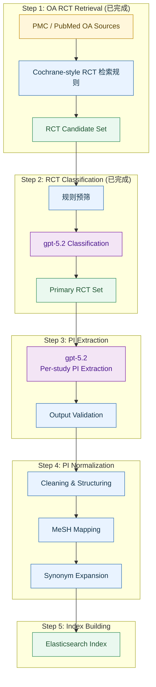
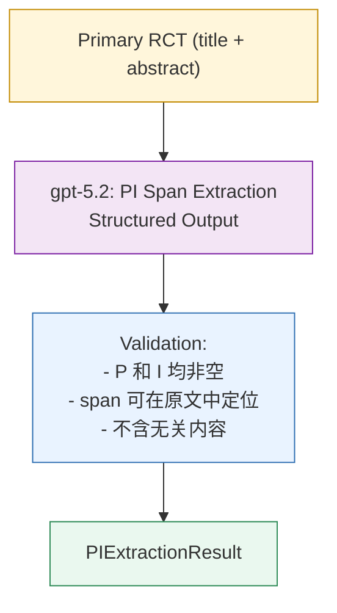
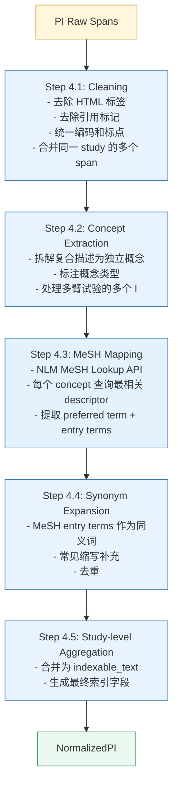

# Module 1: Index Construction — 详细设计

## 1 模块概览



**模块性质：** 离线批处理，不参与实时 pipeline 运行。按需或定期执行（如每月增量更新）。

**当前数据规模（初期）：** 26,163 篇 (PubMed 2023~2026)，均为 primary RCT。后续可扩展至 PMC 全量 76,135 篇。

**当前阶段目标：** 先交付一个可运行的“简化版 Module 1”闭环：`data_demo_with_mesh/` 100 篇样本 -> PI 抽取 -> PI 标准化/MeSH 映射 -> 本地轻量索引 -> 检索测试。该简化版闭环已完成；真实 Batch API 和真实 Elasticsearch 暂时不作为当前交付阻塞项。

**实现状态：**
- 已完成：Step 1 / Step 2 的数据接入与分类结果承接、`data_demo/` 100 篇样本集、`data_demo_with_mesh/` PI-first derived 输出、本地 JSONL 索引、`index-derived` 索引重建入口、`search-local` 自定义 query 检索入口、单篇 demo runner、真实 Chat Completions PI 抽取入口、PI 抽取 prompt/schema、PI 清洗/去重/拆分、NLM MeSH Lookup 在线查询、短语候选与本地兜底 MeSH 映射、同义词扩展、ES mapping 与 IndexDocument 组装、PostgreSQL 状态表、Module 1 Batch runner、`module1_batches` / `module1_studies` 状态回写、batch 断点恢复与跳过已完成 study 的逻辑、相关单元测试
- 当前状态：简化版 Module 1 闭环已完成；100 个 derived 可全部重建到本地索引，固定 5 条 query 检索验证 5/5 通过
- 后续扩展：提升 LLM PI 抽取质量、真实 Batch API 网络验收、失败项自动重提、真实 ES bulk 写入、全量增量更新

---

## 2 Step 1: OA RCT Retrieval（已完成）

### 2.1 职责

从 PMC 和 PubMed 批量拉取 open-access 医学文献，形成 RCT 候选集。

### 2.2 数据来源与检索策略

| 数据源 | 接口 | 检索策略 | 产出规模 |
|--------|------|----------|----------|
| PubMed (2023~2026) | NCBI E-utilities (esearch + efetch) | Cochrane Highly Sensitive Search Strategy for RCTs + OA filter + date filter | 26,163 篇（初期） |
| PMC | NCBI E-utilities | 同上（无 date filter） | 76,135 篇（后续扩展） |

### 2.3 输出

每篇文献获取以下内容：
- PMC XML 全文（含 sections、tables、references）
- PubMed metadata（title、abstract、MeSH terms、publication type）
- 存储为 cleaned JSON 格式（XML → structured sections + tables）

### 2.4 增量更新策略

- 按 publication date 做增量拉取（每月一次）
- 已存在的 PMID 不重复拉取
- 新增文献进入 Step 2 分类流程

---

## 3 Step 2: RCT Classification（已完成）

### 3.1 职责

将候选文献分类为 `primary RCT` / `related RCT` / `non-RCT`，仅保留 primary RCT 进入后续流程。

### 3.2 三分类定义

| 类别 | 定义 | 示例 |
|------|------|------|
| primary RCT | 首次报告该 trial 主要结局的原始 RCT 论文 | "A randomized trial of metformin vs placebo..." |
| related RCT | 同一 trial 的次要分析、长期随访、亚组分析、方法学论文 | "Long-term follow-up of the XXX trial...", "Secondary analysis of..." |
| non-RCT | 非 RCT 文献（观察性研究、综述、meta-analysis、case report 等） | "A systematic review of...", "A cohort study..." |

### 3.3 分类方法

**两阶段策略：规则预筛 + LLM 判断**

1. **规则预筛（快速排除明显 non-RCT）：**
   - Publication type 包含 "Review", "Meta-Analysis", "Case Reports" → non-RCT
   - Title 包含 "systematic review", "meta-analysis", "cohort study" 等关键词 → non-RCT
   - 通过规则的文献进入 LLM 判断

2. **LLM 三分类（gpt-5.2）：**
   - 输入：title + abstract
   - 输出：classification + rationale
   - 仅保留 `primary RCT`

### 3.4 当前结果

初期数据（2023~2026）：
- 输入候选集：~40,000 篇
- 规则预筛排除：~12,000 篇 (non-RCT)
- LLM 分类后保留 primary RCT：26,163 篇

后续扩展（PMC 全量）可增至 ~102,000 篇 primary RCT。

---

## 4 Step 3: PI Extraction

### 4.1 职责

对每篇 primary RCT，使用 LLM 从 title + abstract 中提取 Population (P) 和 Intervention (I) 的原始文本 span。

### 4.2 输入输出定义

**输入：**

| 字段 | 类型 | 说明 |
|------|------|------|
| study_id | string | 文献唯一标识 |
| pmid | string | PubMed ID |
| title | string | 文章标题 |
| abstract | string | 摘要全文 |

**输出（PIExtractionResult）：**

| 字段 | 类型 | 说明 |
|------|------|------|
| study_id | string | 文献标识 |
| population_spans | list[SpanResult] | P 的原始文本 span 列表 |
| intervention_spans | list[SpanResult] | I 的原始文本 span 列表 |
| extraction_source | enum(title/abstract/both) | 抽取来源 |

**SpanResult 结构：**

| 字段 | 类型 | 说明 |
|------|------|------|
| text | string | 原始文本片段 |
| source | enum(title/abstract) | 来源段落 |
| start_char | int? | 起始字符位置（可选，用于追溯） |
| end_char | int? | 结束字符位置（可选） |

### 4.3 处理流程



### 4.4 Prompt 设计要点

- **Role**: 医学文献信息抽取专家
- **Task**: 从 RCT 的 title 和 abstract 中识别并提取描述 Population 和 Intervention 的文本片段
- **Constraints**:
  - 只提取原文中明确出现的文本，不改写、不推断
  - Population：目标人群的描述（疾病、年龄、性别、严重程度等）
  - Intervention：实验组接受的干预措施（药物名称、剂量、疗程、手术方式等）
  - 对照组（Comparison）不在此步骤提取
  - 一篇文献可能有多个 P span 和多个 I span（如多臂试验）
  - 若 abstract 中未明确提及 P 或 I，从 title 中提取
- **Output Format**: 严格按 JSON schema 输出，使用 structured output 模式

### 4.5 设计决策

- **temperature = 0**：确保抽取稳定性
- **只用 title + abstract**：不使用全文。原因：(1) 批量处理 10 万篇，全文 token 成本过高；(2) abstract 中 P 和 I 的描述通常足够用于检索匹配；(3) EBM-NLP benchmark 也是基于 abstract
- **可缓存**：cache key = `study_id + prompt_version`（同一文献的 PI 不会变）
- **当前执行策略**：简化版 Module 1 以逐篇处理为主，优先保证 100 篇样本的可运行闭环；Batch API 保留为后续扩展路径

### 4.5.1 当前实现状态

- 已完成：本地规则版 PI 抽取校验、真实单篇 Chat Completions demo smoke 入口、span 合法性检查、严格 JSON schema、prompt 文件、batch request 组装、Batch API 的请求创建/轮询/输出文件解析、`Module1BatchRunner` 闭环、`module1_studies` / `module1_batches` 回写、active batch 恢复、completed study 默认跳过
- 当前简化路径：100 篇样本优先走逐篇 PI 抽取，避免真实 Batch API 集成成为当前阻塞
- 后续扩展：真实 Batch API 网络验收、失败重提策略与批次级别告警

### 4.6 错误处理

| 错误类型 | 处理方式 |
|----------|----------|
| JSON 解析失败 | 重试 1 次，仍失败则标记 `extraction_error` |
| P 或 I 为空 | 重试 1 次（换 prompt 变体），仍为空则标记 `incomplete_extraction` |
| span 无法在原文中定位 | 保留抽取结果但标记 `span_mismatch` |
| LLM 超时 | 重试 2 次（指数退避） |
| 输出包含非原文内容 | 标记 `hallucination_suspected`，人工抽检 |

### 4.7 Batch 扩展入口

- 代码入口：`ebm_backend.index_construction.application.run_module1_batch_sync`
- 默认语义：读取 `data_demo/manifest/files.jsonl` 中前 100 篇 `primary_rct`
- Batch endpoint：`/v1/responses`
- `custom_id`：`{study_id}:pi_extraction`
- 回写规则：
  - P/I 非空且 span 可定位：`module1_studies.extraction_status = completed`
  - API item error、JSON 解析失败、P/I 为空、span mismatch：`module1_studies.extraction_status = failed`
  - 已有 active batch：优先轮询并回收，不重复提交
  - 已完成 study：默认跳过，只有 `force=True` 才重新提交

### 4.8 简化版当前入口

- 数据集：`data_demo_with_mesh/`
- 执行方式：逐篇处理 100 篇 `primary_rct`
- 输出：PI 抽取结果、标准化/MeSH 映射结果、本地可检索索引、固定 query 检索测试
- 目标：先验证 Module 1 的完整业务闭环，再决定是否切回真实 Batch API 和真实 Elasticsearch

---

## 5 Step 4: PI Normalization

### 5.1 职责

对 Step 3 抽取的 PI 原始 span 进行清洗、结构化拆解、医学概念标准化和同义词扩展，转化为可用于检索匹配的结构化索引字段。

### 5.2 输入输出定义

**输入：**

| 字段 | 类型 | 来源 |
|------|------|------|
| study_id | string | 文献标识 |
| population_spans | list[SpanResult] | Step 3 PI Extraction 输出 |
| intervention_spans | list[SpanResult] | Step 3 PI Extraction 输出 |

**输出（NormalizedPI）：**

| 字段 | 类型 | 说明 |
|------|------|------|
| study_id | string | 文献标识 |
| population | NormalizedField | 标准化后的 P 字段 |
| intervention | NormalizedField | 标准化后的 I 字段 |

**NormalizedField 结构：**

| 字段 | 类型 | 说明 |
|------|------|------|
| original_spans | list[string] | 原始 span 文本（保留追溯） |
| cleaned_text | string | 清洗后的合并文本 |
| concepts | list[MedicalConcept] | 拆解出的医学概念列表 |
| mesh_terms | list[MeSHTerm] | MeSH 映射结果 |
| synonyms | list[string] | 扩展的同义词列表 |
| indexable_text | string | 最终写入 ES 的可检索文本 |

**MedicalConcept 结构：**

| 字段 | 类型 | 说明 |
|------|------|------|
| text | string | 概念文本 |
| type | enum(disease/condition/age_group/drug/procedure/device/other) | 概念类型 |
| mesh_descriptor | string? | 对应的 MeSH descriptor（如有） |

**MeSHTerm 结构：**

| 字段 | 类型 | 说明 |
|------|------|------|
| descriptor_id | string | MeSH Descriptor UID |
| preferred_term | string | MeSH preferred term |
| entry_terms | list[string] | MeSH entry terms（同义词） |
| match_source | string | 匹配来源（原始 span 中的哪个词） |

### 5.3 处理流程



### 5.4 各子步骤详述

#### 5.4.1 Cleaning

| 操作 | 说明 | 示例 |
|------|------|------|
| HTML 标签去除 | 去除 `<p>`, `<br/>`, `<sub>` 等 | `<p>adults with T2DM</p>` → `adults with T2DM` |
| 引用标记去除 | 去除 `[1]`, `(ref)` 等 | `metformin [23]` → `metformin` |
| 编码统一 | Unicode 标准化，全角→半角 | `ｍｅｔｆｏｒｍｉｎ` → `metformin` |
| 多 span 合并 | 同一 study 的多个 P/I span 合并为一个文本 | `["adults", "with type 2 diabetes"]` → `adults with type 2 diabetes` |
| 首尾空白和冗余标点 | trim + 去除尾部句号 | `"metformin."` → `metformin` |

#### 5.4.2 Concept Extraction

将清洗后的文本拆解为独立的医学概念。这一步**不调用 LLM**，使用规则 + 简单 NLP：

- **Population 拆解规则：**
  - 按 "with", "and", "," 等连接词拆分
  - 识别疾病/条件、年龄组、性别等维度
  - 示例：`"adults aged 18-65 with type 2 diabetes and hypertension"` → `["type 2 diabetes", "hypertension", "adults aged 18-65"]`

- **Intervention 拆解规则：**
  - 多臂试验按 "and", "or", "versus", "vs" 拆分
  - 识别药物名称、剂量、疗程
  - 示例：`"metformin 500mg twice daily for 12 weeks"` → `["metformin"]`（剂量和疗程不作为检索字段）

#### 5.4.3 MeSH Mapping

- **接口：** NLM MeSH Lookup API (`https://id.nlm.nih.gov/mesh/lookup/descriptor`)
- **策略：** 对每个 concept 查询，取最相关的 descriptor
- **限制：** 每个 descriptor 最多保留 10 个 entry terms
- **未命中处理：** concept 保留原文形式，标记 `mesh_mapped: false`

#### 5.4.4 Synonym Expansion

同义词来源（优先级从高到低）：
1. MeSH entry terms（最可靠）
2. MeSH preferred term（如果原文用的是 entry term）
3. 常见缩写映射表（如 T2DM ↔ type 2 diabetes mellitus）

**不使用 LLM 做同义词扩展。** 原因同 Module 2 Query Generation 的设计决策：MeSH entry terms 已覆盖标准同义词，LLM 生成的同义词有幻觉风险。

#### 5.4.5 Study-level Aggregation

将所有标准化结果合并为最终的索引字段：

```
indexable_text = original_cleaned + " " + mesh_preferred_terms + " " + entry_terms + " " + synonyms
```

去重后作为 ES 中 `population` / `intervention` 字段的内容。

### 5.5 设计决策

- **不用 LLM 做 Normalization**：Normalization 是确定性的文本处理任务，规则 + API 更稳定、更便宜、可复现
- **MeSH 作为唯一标准化来源**：不引入 UMLS、SNOMED 等其他本体，降低复杂度
- **保留原始 span**：标准化后仍保留原始文本，支持审计和 fallback
- **批量处理 MeSH API**：对 10 万篇文献的 concept 做去重后再查询 MeSH，减少 API 调用次数

### 5.7 当前实现状态

- 已完成：清洗、span 去重、概念拆解、短语候选生成、缩写扩展、NLM MeSH Lookup API 在线查询、兜底 MeSH 字典、MeSH term 去重、indexable_text 生成
- 部分完成：entry terms 抽取、批量 concept 去重缓存、复杂医学短语拆分质量
- 未完成：更完整的失败告警、批量缓存持久化

### 5.6 错误处理

| 错误类型 | 处理方式 |
|----------|----------|
| MeSH API 不可用 | 降级为仅使用 cleaned_text，不做 MeSH 映射 |
| MeSH 未命中 | 正常，该 concept 以原文形式写入索引 |
| Concept extraction 产出为空 | 使用 cleaned_text 整体作为一个 concept |
| 编码异常 | 跳过该字符，记录 warning |

---

## 6 Step 5: Index Building

### 6.1 职责

将标准化后的 PI 数据和文献 metadata 写入索引，构建 RCT Retrieval Index，供 Module 2 在线检索使用。当前简化版优先使用本地轻量索引；真实 Elasticsearch 作为后续扩展。

### 6.2 ES Index Mapping

**索引名称：** `ebm_rct_index`

| 字段 | ES 类型 | 说明 |
|------|---------|------|
| study_id | keyword | 唯一标识（自动生成） |
| pmid | keyword | PubMed ID |
| pmcid | keyword | PMC ID（可选） |
| title | text (english analyzer) | 文章标题 |
| abstract | text (english analyzer) | 摘要 |
| population | text (english analyzer) | 标准化后的 P 字段（indexable_text） |
| intervention | text (english analyzer) | 标准化后的 I 字段（indexable_text） |
| population_original | text (english analyzer) | P 原始 span（用于 fallback 匹配） |
| intervention_original | text (english analyzer) | I 原始 span（用于 fallback 匹配） |
| mesh_terms | keyword (array) | 文献的 MeSH 标签（来自 PubMed metadata） |
| mesh_population | keyword (array) | P 映射到的 MeSH descriptors |
| mesh_intervention | keyword (array) | I 映射到的 MeSH descriptors |
| article_type | keyword | primary_rct（当前全部为此值） |
| open_access | boolean | 是否 OA（当前全部为 true） |
| source | keyword | PMC / PubMed |
| publication_year | integer | 发表年份 |
| article_path | keyword | 全文文件路径 |
| indexed_at | date | 入库时间 |

### 6.3 Analyzer 配置

```json
{
  "settings": {
    "analysis": {
      "analyzer": {
        "english_medical": {
          "type": "custom",
          "tokenizer": "standard",
          "filter": ["lowercase", "english_stop", "english_stemmer", "english_possessive_stemmer"]
        }
      },
      "filter": {
        "english_stop": { "type": "stop", "stopwords": "_english_" },
        "english_stemmer": { "type": "stemmer", "language": "english" },
        "english_possessive_stemmer": { "type": "stemmer", "language": "possessive_english" }
      }
    }
  }
}
```

**设计决策：使用 English analyzer 而非 medical-specific analyzer。** 原因：
- ES 内置的 english analyzer 已包含 stemming（如 diabetes/diabetic → diabet）
- 医学专用 analyzer（如基于 UMLS 的）增加部署复杂度，收益有限
- MeSH 映射已在 Normalization 阶段完成，ES 层面不需要再做术语标准化

### 6.4 写入策略

**批量写入：**
- 使用 ES Bulk API，每批 1000 条
- 写入前检查 study_id 是否已存在（避免重复）
- 已存在的文献做 update（PI 可能因 prompt 版本更新而变化）

**增量更新：**
- 新增文献：直接 bulk insert
- PI 更新（prompt 版本变化）：按 study_id 做 partial update（只更新 PI 相关字段）
- 删除：标记 `deleted: true`，不物理删除

### 6.5 索引验证

写入完成后执行以下验证：

| 验证项 | 方法 | 通过标准 |
|--------|------|----------|
| 文档总数 | `GET _count` | 等于 primary RCT 总数 |
| 字段非空率 | 抽样 1000 条检查 | population 和 intervention 非空率 > 95% |
| 检索可用性 | 执行 5 条已知 query | 每条 query 返回 > 0 结果 |
| 响应时间 | 执行 10 条 query 取平均 | < 100ms |

### 6.8 当前实现状态

- 已完成：索引字段设计、IndexDocument 字段、PI-first demo export 中的 `document` 结构
- 简化版已完成：本地轻量索引和检索测试已覆盖 100 篇 `data_demo_with_mesh` 样本，可通过 `index-derived` 重建索引并通过 `search-local` 查看检索输出
- 后续扩展：真实 ES bulk 写入、索引验证脚本、重跑与增量更新策略

### 6.6 部署方式

- 单节点 Elasticsearch（按需独立部署）
- 数据持久化到 Docker volume
- 内存配置：`ES_JAVA_OPTS=-Xms2g -Xmx2g`（10 万级文档足够）
- 单 shard，0 replica（单机部署）

### 6.7 错误处理

| 错误类型 | 处理方式 |
|----------|----------|
| ES 连接失败 | 重试 3 次，仍失败则暂停写入 |
| Bulk 写入部分失败 | 记录失败的 study_id，后续重试 |
| Mapping 冲突 | 检查字段类型，必要时 reindex |
| 磁盘空间不足 | 告警，暂停写入 |

---

## 7 模块级编排

### 7.1 执行顺序


严格串行。每个 step 的输出是下一个 step 的输入。

### 7.2 批量处理策略

| Step | 处理单元 | 并发度 | 预估耗时（2.6万篇） |
|------|----------|--------|---------------------|
| Step 3 PI Extraction | per-study LLM 调用 | 逐篇执行（当前） | 取决于单篇 API 延迟 |
| Step 4 Normalization | per-study 规则处理 | 多线程 | ~10 分钟 |
| Step 4 MeSH Mapping | per-concept API 调用 | 并发 10 | ~30 分钟 |
| Step 5 Index Building | 本地轻量索引构建 | 单线程 | 分钟级 |

### 7.3 断点续跑

- 每个 step 完成后将结果持久化到 SQLite（study_id → result JSON）
- 重跑时检查已完成的 study_id，跳过已处理的
- 支持从任意 step 重新开始（如 prompt 版本更新后只需重跑 Step 3+4+5）

### 7.4 LLM 调用量与成本

| Step | 调用次数 | 说明 |
|------|----------|------|
| Step 2 Classification | ~26,000 | 已完成 |
| Step 3 PI Extraction | ~26,000 | 当前简化版只验证 100 篇；全量时再评估 Batch API |
| **总计** | **~26,000** | 一次性成本，后续增量更新仅处理新增文献 |

---

## 8 测试策略

### 8.1 单元测试

| 测试对象 | 验证内容 |
|----------|----------|
| PI Extraction LLM 输出 | 符合 schema，P 和 I 非空，span 可在原文定位 |
| Cleaning 规则 | HTML 去除、编码统一、多 span 合并 |
| Concept Extraction | 复合描述正确拆分 |
| MeSH Mapping | 已知术语能正确映射到 descriptor |
| Synonym Expansion | 扩展结果不含重复，不含无关术语 |
| ES Bulk Write | 写入成功，字段类型正确 |

### 8.2 集成测试（PI Extraction）

**Benchmark: EBM-NLP**

- 数据源：`https://github.com/bepnye/EBM-NLP`
- 任务：从 4,993 篇摘要中识别 Participants 和 Interventions 的 span
- 评估指标：
  - Token-level F1（与 ground truth span 的 overlap）
  - Exact match rate（完整 span 匹配）
  - Semantic similarity（抽取内容与 ground truth 的语义相似度）

### 8.3 集成测试（End-to-end Index Quality）

- 选取 20 个已知的 PICO 问题（来自 Q2CRBench-3）
- 对每个问题生成 Boolean query（使用 Module 2 的 Query Generation）
- 在构建好的索引中执行检索
- 验证已知的 ground truth 文献是否被召回
- 目标：recall@200 > 80%

### 8.4 数据质量监控

| 指标 | 计算方式 | 告警阈值 |
|------|----------|----------|
| PI 非空率 | 有 P 且有 I 的文献占比 | < 95% |
| MeSH 命中率 | 至少一个 concept 映射到 MeSH 的文献占比 | < 70% |
| 平均 concept 数 | 每篇文献的 P+I concept 平均数 | < 2 或 > 10 |
| 索引文档数 | ES 中的文档总数 | 与 primary RCT 总数不一致 |
