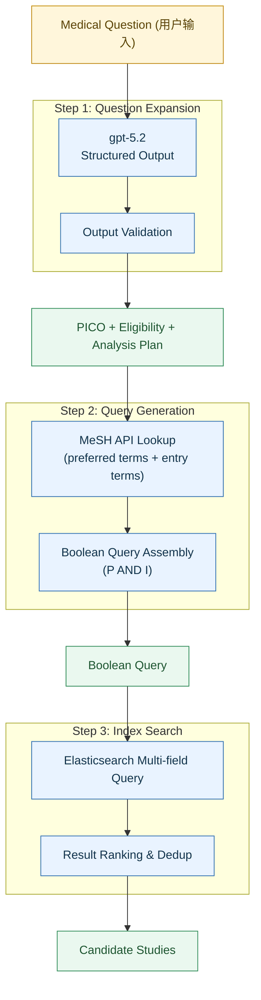
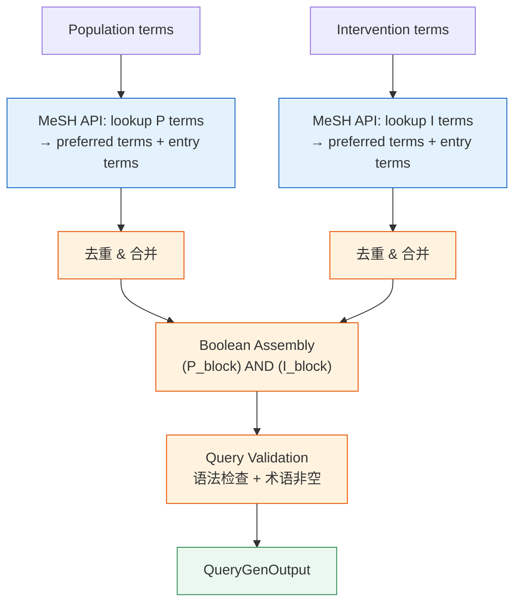

# Module 2: Question-to-Study — 详细设计

- **Status:** reference
- **Last Reviewed:** 2026-05-15
- **Source of Truth:** Module 2 design reference.

## 1 模块概览

---

## 2 Step 1: Question Expansion

### 2.1 职责

将用户输入的自然语言临床问题扩写为结构化的 PICO、eligibility criteria 和 preliminary analysis plan。

### 2.2 输入输出定义

**输入：**

| 字段 | 类型 | 说明 |
|------|------|------|
| question | string | 用户输入的原始临床问题 |

**输出：**

| 字段 | 类型 | 说明 |
|------|------|------|
| pico.population | list[string] | 目标人群 |
| pico.intervention | list[string] | 干预措施 |
| pico.comparison | list[string] | 对照 |
| pico.outcome | list[string] | 结局指标（含 primary + secondary） |
| eligibility_criteria.inclusion | list[string] | 纳入标准 |
| eligibility_criteria.exclusion | list[string] | 排除标准 |
| eligibility_criteria.confidence | enum(high/medium/low) | 置信度 |
| preliminary_analysis_plan.primary_outcome | string | 主要结局 |
| preliminary_analysis_plan.secondary_outcomes | list[string] | 次要结局 |
| preliminary_analysis_plan.timepoints | list[string] | 时间点 |
| preliminary_analysis_plan.effect_measures | object | continuous → MD/SMD, binary → RR/OR |
| preliminary_analysis_plan.subgroups_of_interest | list[string] | 感兴趣的亚组 |
| preliminary_analysis_plan.confidence | enum(high/medium/low) | 置信度 |
| expanded_question | string | 扩写后的完整研究问题描述 |
| needs_user_confirmation | list[string] | confidence=low 的字段，建议用户确认 |

### 2.3 Prompt 设计要点

- **Role**: 循证医学方法学专家
- **Task**: 将临床问题扩写为完整的 PICO + eligibility + preliminary analysis plan
- **Constraints**:
  - 对每个补充字段标注 confidence（high/medium/low）
  - 不编造不存在的临床概念
  - Outcome 覆盖有效性和安全性
  - Timepoints 基于该疾病领域的常见随访时间
  - Effect measure 根据 outcome 类型选择
- **Output Format**: 严格按 JSON schema 输出，使用 structured output 模式

### 2.4 设计决策

- **temperature = 0**：确保输出稳定性
- **不缓存**：同一问题用户意图可能不同，且此步骤只调用 1 次
- **confidence 标注机制**：low confidence 字段不自动用于下游过滤，标记为 needs_user_confirmation

### 2.5 错误处理

| 错误类型 | 处理方式 |
|----------|----------|
| JSON 解析失败 | 重试 1 次，仍失败则返回 raw text + error flag |
| Schema 校验失败 | 尝试修复缺失字段，无法修复则重试 |
| LLM 超时 | 重试 2 次（指数退避） |
| 输入非医学问题 | 输出中标记 `is_medical_question: false`，前端提示 |

---

## 3 Step 2: Query Generation

### 3.1 职责

从 PICO 的 P 和 I 字段出发，通过 MeSH API 完成术语映射，生成 Boolean 检索式。

**设计决策：只用 MeSH API，不用 LLM 做同义词扩展。** 原因：
- MeSH 的 entry terms 已经覆盖了标准同义词、缩写和变体
- LLM 生成的"同义词"存在幻觉风险（可能生成不存在的术语）
- 检索阶段追求高召回，MeSH entry terms + preferred terms 已经足够宽泛

### 3.2 输入输出定义

**输入：**

| 字段 | 类型 | 来源 |
|------|------|------|
| population | list[string] | 来自 Step 1 PICO |
| intervention | list[string] | 来自 Step 1 PICO |

**中间结果（术语映射）：**

| 字段 | 类型 | 说明 |
|------|------|------|
| original | string | 原始术语 |
| mesh_preferred | list[string] | MeSH preferred terms |
| entry_terms | list[string] | MeSH entry terms（同义词、缩写） |

**输出：**

| 字段 | 类型 | 说明 |
|------|------|------|
| boolean_query | string | 最终 Boolean 检索式 |
| population_block | string | P 部分检索式 |
| intervention_block | string | I 部分检索式 |
| mapping_detail | object | 术语映射详情，供审计追溯 |
| search_filters | object | 固定过滤条件 (open_access, article_type) |

### 3.3 处理流程

### 3.4 Boolean 组装规则

- P block: 将 P 的所有 preferred terms + entry terms 用 OR 连接
- I block: 将 I 的所有 preferred terms + entry terms 用 OR 连接
- 最终检索式: `(P_block) AND (I_block)`
- 每个 term 用双引号包裹（精确短语匹配）
- 去重时忽略大小写

### 3.5 MeSH API 调用方案

- 接口：NLM MeSH Lookup API (`https://id.nlm.nih.gov/mesh/lookup/descriptor`)
- 对每个 P/I 术语查询，获取最相关的 descriptor
- 从 descriptor 中提取 preferred term 和 entry terms（限制每个 descriptor 最多 10 个 entry terms）
- MeSH 未命中时：直接使用原始术语作为 free-text 加入检索式

### 3.6 错误处理

| 错误类型 | 处理方式 |
|----------|----------|
| MeSH API 不可用 | 降级为直接使用原始 P/I 术语构建检索式 |
| MeSH 未命中某术语 | 正常，该术语以原文形式加入检索式 |
| 生成的 query 为空 | 回退到原始 P/I 文本作为 query |

---

## 4 Step 3: Index Search

### 4.1 职责

在 Elasticsearch RCT Retrieval Index 中执行检索，返回候选文献列表。

### 4.2 为什么选 Elasticsearch

本项目的检索需求是 **结构化字段匹配 + 全文检索 + Boolean 逻辑组合**，这正是 Elasticsearch 的核心能力：

| 需求 | ES 如何满足 |
|------|------------|
| PI 结构化字段精确匹配 | 对 population / intervention 字段建立独立索引，支持 term-level query |
| Title / Abstract 全文检索 | 内置 BM25 评分，支持 match query 和 phrase match |
| MeSH 术语匹配 | mesh_terms 字段用 keyword 类型，支持精确匹配 |
| Boolean 逻辑 (AND/OR) | bool query 原生支持 must / should / filter 组合 |
| 多字段加权 | boost 参数控制不同字段的权重 |
| 过滤条件 (open_access, article_type) | filter context 不参与评分，高效过滤 |
| 10 万级数据 | 单节点轻松处理，响应 <100ms |
| 未来扩展 | 可加入向量字段做 hybrid search |

**部署方式：** Docker 单节点，初期不需要集群。数据持久化到 Docker volume。

**索引 mapping 核心字段：**

| 字段 | 类型 | 说明 |
|------|------|------|
| study_id | keyword | 唯一标识 |
| pmid | keyword | PubMed ID |
| pmcid | keyword | PMC ID |
| title | text (english analyzer) | 文章标题 |
| abstract | text (english analyzer) | 摘要 |
| population | text (english analyzer) | 提取的 P 字段 |
| intervention | text (english analyzer) | 提取的 I 字段 |
| mesh_terms | keyword (array) | MeSH 标签 |
| article_type | keyword | primary_rct / related_rct / non_rct |
| open_access | boolean | 是否 OA |
| source | keyword | PMC / PubMed |
| article_path | keyword | 全文文件路径 |

### 4.3 输入输出定义

**输入：**

| 字段 | 类型 | 说明 |
|------|------|------|
| boolean_query | string | 来自 Step 2 的 Boolean 检索式 |
| filters | object | {open_access: true, article_type: "primary_rct"} |
| max_results | int | 最大返回数量，默认 200 |

**输出：**

| 字段 | 类型 | 说明 |
|------|------|------|
| query_used | string | 实际执行的检索式 |
| total_hits | int | ES 命中总数 |
| returned_count | int | 实际返回数量 |
| studies | list[CandidateStudy] | 候选文献列表 |
| fallback_level | int | 0=正常, 1/2/3=降级程度 |

**CandidateStudy 结构：**

| 字段 | 类型 | 说明 |
|------|------|------|
| study_id | string | 唯一标识 |
| pmid | string? | PubMed ID |
| pmcid | string? | PMC ID |
| title | string | 标题 |
| abstract | string? | 摘要 |
| population | string? | 索引中的 P 字段 |
| intervention | string? | 索引中的 I 字段 |
| source | string | PMC / PubMed |
| relevance_score | float | ES BM25 分数 |
| article_path | string? | 全文文件路径 |

### 4.4 查询策略

**多字段加权检索：**
- PI 结构化字段（population, intervention）：boost 3.0
- Title + Abstract：boost 2.0
- MeSH terms：boost 1.5
- P block 和 I block 必须同时命中（must 关系）
- open_access 和 article_type 作为 filter（不影响评分）

**Fallback 策略（结果过少时逐步放宽）：**

| Level | 条件 | 放宽方式 |
|-------|------|----------|
| 0 | hits >= 5 | 正常返回 |
| 1 | hits < 5 | 移除 boost 差异，所有字段平等匹配 |
| 2 | 仍 < 5 | P 和 I 改为 should（不要求同时命中） |
| 3 | 仍 < 5 | 移除 article_type filter（允许 related RCT） |

每次 fallback 在输出中标记 `fallback_level`，供下游 screening 参考。

### 4.5 错误处理

| 错误类型 | 处理方式 |
|----------|----------|
| ES 连接失败 | 重试 3 次，仍失败则 pipeline 暂停 |
| 查询语法错误 | 降级为 simple_query_string 模式 |
| 结果为 0 | 执行 fallback 策略，仍为 0 则标记 `no_results` |
| 结果过多（>500） | 截断并标记 `truncated: true` |

---

## 5 模块级编排

### 5.1 执行顺序

Step 1 → Step 2 → Step 3，严格串行。每个 step 的输出是下一个 step 的输入。

### 5.2 模块输出（传递给 Module 3）

Module 2 的完整输出包含三部分，全部传递给 Module 3：

| 输出 | 下游使用方 |
|------|-----------|
| PICO + eligibility_criteria | Module 3 Study Screening（用于纳入/排除判断） |
| preliminary_analysis_plan | Module 3 Analysis Planning（用于初始化 analysis list） |
| candidate studies | Module 3 Study Screening（待筛选文献列表） |
| mapping_detail | 审计追溯（不参与下游计算） |

### 5.3 human-in-the-loop 介入点

- 当 expansion 输出中存在 `needs_user_confirmation` 字段时，前端展示提示
- 用户可选择确认或修改 PICO / eligibility / analysis plan
- 修改后从 Step 2 重新执行（不需要重跑 Step 1）

---

## 6 测试策略

### 6.1 单元测试

- 验证 LLM 输出符合定义的 schema
- Mock MeSH API，验证术语映射和 Boolean 组装逻辑
- 验证 ES Query DSL 生成的正确性
- 验证 fallback 策略的触发条件

### 6.2 集成测试

- 用 Q2CRBench-3 的 99 条问题验证 PICO 拆解质量
- 给定已知 PICO + 已知纳入文献，验证检索召回率

### 6.3 Benchmark

- **Q2CRBench-3 Clinical_Questions**: 99 条问题的 PICO 拆解
- 评估指标：P/I/C/O 各字段与 ground truth 的 semantic similarity
