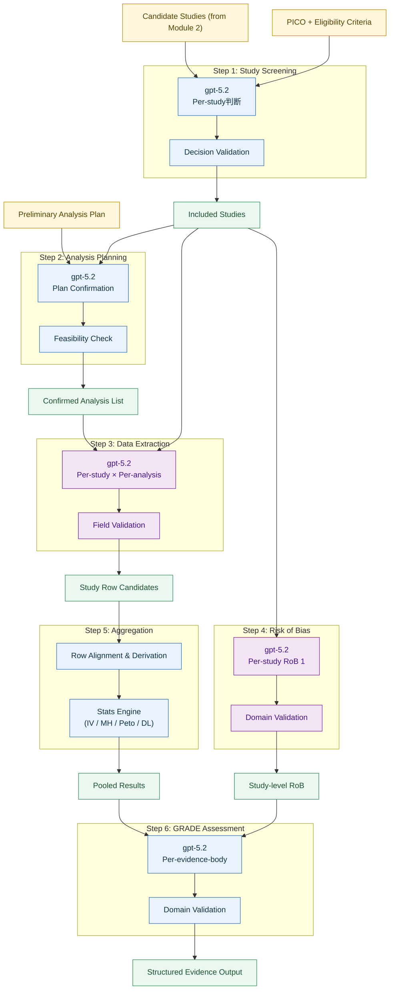
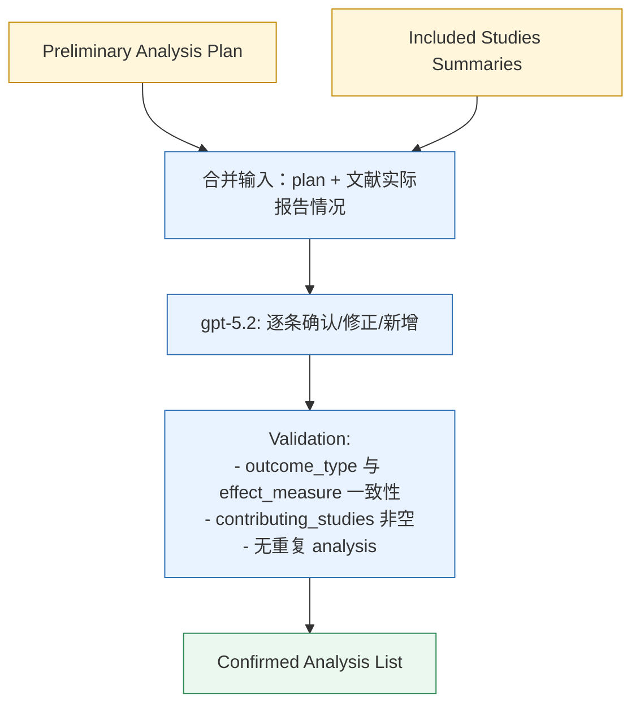
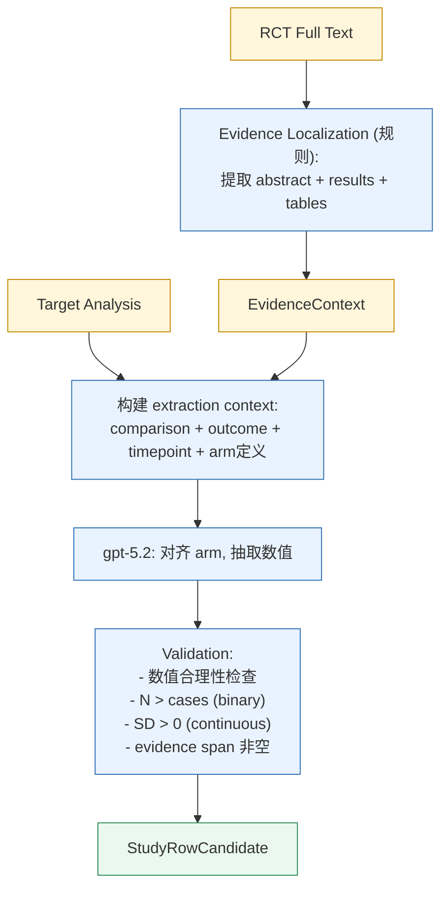
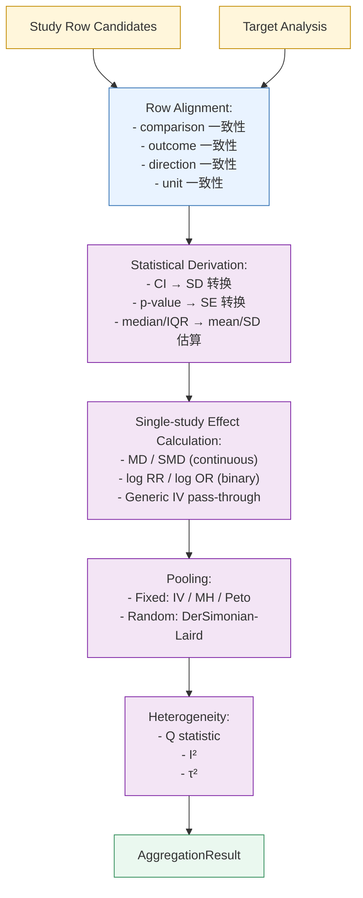
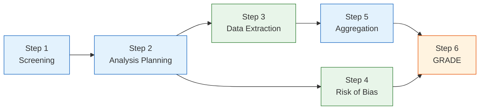

# Module 3: EBM Annotation and Analysis — 详细设计

## 1 模块概览



**并行关系：**
- Step 1 → Step 2 严格串行
- Step 3 (Data Extraction) 和 Step 4 (Risk of Bias) 可并行执行
- Step 5 依赖 Step 3 完成
- Step 6 依赖 Step 4 和 Step 5 同时完成

---

## 2 Step 1: Study Screening

### 2.1 职责

对 Module 2 返回的候选文献逐篇进行纳入/排除判断，依据 PICO 匹配度和 eligibility criteria 筛选出符合条件的文献。

### 2.2 输入输出定义

**输入：**

| 字段 | 类型 | 来源 |
|------|------|------|
| pico | object | Module 2 Question Expansion 输出 |
| eligibility_criteria | object | Module 2 Question Expansion 输出 |
| candidate_studies | list[CandidateStudy] | Module 2 Index Search 输出 |

**输出（per study）：**

| 字段 | 类型 | 说明 |
|------|------|------|
| study_id | string | 文献唯一标识 |
| decision | enum(include/exclude) | 纳入/排除决策 |
| rationale | string | 决策理由（简要说明为何纳入或排除） |
| exclusion_reason | string? | 排除原因分类（仅 exclude 时，如 "wrong population", "wrong intervention", "not RCT"） |

**模块输出（汇总）：**

| 字段 | 类型 | 说明 |
|------|------|------|
| included_studies | list[CandidateStudy] | 通过筛选的文献列表 |
| excluded_studies | list[ExcludedStudy] | 被排除的文献及理由 |
| screening_summary | object | 统计摘要（总数、纳入数、排除数） |

### 2.3 Prompt 设计要点

- **Role**: 循证医学系统评价方法学专家，负责 title/abstract screening
- **Task**: 根据给定的 PICO 和 eligibility criteria，整体判断候选文献是否应纳入系统评价
- **Constraints**:
  - 做整体纳入/排除判断，不逐维度打分
  - 重点关注 C 和 O 的匹配（P 和 I 已在检索阶段过滤）
  - 排除决策必须给出具体原因，引用 eligibility criteria 中的条款
  - 当信息不足以确定排除时，倾向纳入（宁多勿漏）
  - 不编造文献中未提及的信息
- **Output Format**: 严格按 JSON schema 输出，使用 structured output 模式

### 2.4 设计决策

- **temperature = 0**：确保判断一致性
- **逐篇调用**：每篇文献独立判断，避免上下文干扰
- **宁多勿漏原则**：当 abstract 信息不足以确定排除时，默认纳入，交由后续全文阶段再判断
- **可缓存**：同一 PICO + 同一文献的 screening 结果稳定，cache key = `study_id + pico_hash + prompt_version`

### 2.5 错误处理

| 错误类型 | 处理方式 |
|----------|----------|
| JSON 解析失败 | 重试 1 次，仍失败则标记该文献为 `screening_error`，默认纳入 |
| Schema 校验失败 | 尝试修复缺失字段，无法修复则重试 |
| LLM 超时 | 重试 2 次（指数退避） |
| 候选文献无 abstract | 仅基于 title 判断，标记 `limited_info: true` |

---

## 3 Step 2: Analysis Planning

### 3.1 职责

结合纳入文献的实际报告情况，对 Module 2 产出的 preliminary analysis plan 进行确认或修正，输出 confirmed target_analysis list。每条 target_analysis 定义一个具体的分析单元，作为后续 Data Extraction 和 Aggregation 的驱动。

### 3.2 输入输出定义

**输入：**

| 字段 | 类型 | 来源 |
|------|------|------|
| preliminary_analysis_plan | object | Module 2 Question Expansion 输出 |
| included_studies | list[IncludedStudy] | Step 1 Screening 输出 |

其中 `included_studies` 每条包含：

| 字段 | 类型 | 说明 |
|------|------|------|
| study_id | string | 文献标识 |
| title | string | 标题 |
| abstract | string? | 摘要 |
| reported_outcomes | list[string] | 摘要中提及的结局指标 |
| reported_timepoints | list[string] | 摘要中提及的时间点 |
| outcome_data_hints | object? | 数据类型提示（continuous/binary） |

**输出：**

| 字段 | 类型 | 说明 |
|------|------|------|
| confirmed_analysis_list | list[TargetAnalysis] | 确认的分析列表 |
| dropped_analyses | list[DroppedAnalysis] | 被移除的预设分析及原因 |
| added_analyses | list[TargetAnalysis] | 新增的分析（文献中发现但 preliminary plan 未覆盖） |

**TargetAnalysis 结构：**

| 字段 | 类型 | 说明 |
|------|------|------|
| analysis_id | string | 分析唯一标识（如 `analysis_001`） |
| comparison | string | 比较组定义（如 "metformin vs placebo"） |
| outcome | string | 结局指标 |
| outcome_type | enum(continuous/binary/generic_iv) | 数据类型 |
| effect_measure | string | 效应量指标（MD/SMD/RR/OR/HR） |
| timepoint | string | 时间点 |
| subgroup | string? | 亚组定义（如适用） |
| status | enum(confirmed/added/modified) | 相对于 preliminary plan 的状态 |
| note | string | 确认/修改理由 |
| contributing_studies | list[string] | 预期贡献数据的文献 ID 列表 |

### 3.3 处理流程



### 3.4 Prompt 设计要点

- **Role**: 循证医学方法学专家，负责制定 meta-analysis 的分析计划
- **Task**: 根据纳入文献的实际报告情况，确认或修正 preliminary analysis plan
- **Constraints**:
  - 每条 analysis 必须至少有 1 篇文献可能贡献数据
  - effect_measure 必须与 outcome_type 匹配（continuous → MD/SMD, binary → RR/OR, time-to-event → HR）
  - 若某 outcome 在所有纳入文献中均未报告，标记为 dropped 并说明原因
  - 若文献中发现 preliminary plan 未覆盖但临床重要的 outcome，可新增
  - 不创造文献中未提及的 outcome 或 timepoint
- **Output Format**: 严格按 JSON schema 输出，使用 structured output 模式

### 3.5 设计决策

- **temperature = 0**：确保计划稳定性
- **单次调用**：将所有纳入文献摘要和 preliminary plan 一次性传入，整体判断
- **不缓存**：analysis plan 依赖纳入文献集合，集合变则结果变
- **显式步骤**：该步骤独立于 Data Extraction，使下游输入定义更清晰

### 3.6 错误处理

| 错误类型 | 处理方式 |
|----------|----------|
| JSON 解析失败 | 重试 1 次，仍失败则使用 preliminary plan 作为 fallback |
| 输出 analysis_list 为空 | 异常，重试；仍为空则标记 `planning_error` |
| LLM 超时 | 重试 2 次（指数退避） |
| outcome_type 与 effect_measure 不匹配 | 自动修正（按规则映射） |

---

## 4 Step 3: Meta-analysis Data Extraction

### 4.1 职责

对每篇纳入文献，按 confirmed_analysis_list 中的每条 target_analysis，从文本中抽取可直接用于 meta-analysis 计算的数值字段，并为每个字段保留 evidence span。

**核心原则：只抽取原文中可直接观察到的字段，不做统计派生。** 统计转换（如从 CI 反推 SD）统一在 Step 5 Aggregation 中完成。

### 4.2 输入输出定义

**输入：**

| 字段 | 类型 | 来源 |
|------|------|------|
| target_analysis | TargetAnalysis | Step 2 confirmed_analysis_list 中的单条 |
| evidence_context | EvidenceContext | 从全文中按固定规则预筛选的相关段落 |

**EvidenceContext 结构（Data Extraction 固定传入 abstract + results + tables）：**

| 字段 | 类型 | 说明 |
|------|------|------|
| study_id | string | 文献标识 |
| pmid | string | PubMed ID |
| pmcid | string? | PMC ID |
| title | string | 标题 |
| abstract | string | 摘要 |
| results_section | string | Results 部分文本 |
| tables | list[Table] | 结构化表格内容 |
| source_coverage | enum(full_text/abstract_only) | 数据来源覆盖度 |

**段落筛选规则（不调用 LLM，固定规则）：**
- Data Extraction：传入 abstract + results section + tables
- Risk of Bias：传入 abstract + methods section

**输出（StudyRowCandidate）：**

| 字段 | 类型 | 说明 |
|------|------|------|
| study_id | string | 文献标识 |
| target_analysis_id | string | 对应的 analysis ID |
| row_metadata | object | 比较组、outcome、effect_measure、timepoint、arm_mapping |
| observed_fields | object | 抽取的数值字段（见下表） |
| evidence_spans | object | 每个字段对应的原文证据片段 |
| missing_fields | list[string] | 原文未报告的字段 |
| extraction_confidence | enum(high/medium/low) | 抽取置信度 |
| notes | string? | 特殊情况说明 |

**observed_fields 候选字段（按 outcome_type）：**

| outcome_type | 候选字段 |
|--------------|----------|
| continuous | Experimental mean, Experimental SD, Experimental N, Control mean, Control SD, Control N |
| binary | Experimental cases, Experimental N, Control cases, Control N |
| generic_iv | GIV Mean (log scale), GIV SE |
| time-to-event | O-E, Variance |

### 4.3 处理流程



### 4.4 Prompt 设计要点

- **Role**: 循证医学数据抽取专家，负责从 RCT 文本中提取 meta-analysis 所需数值
- **Task**: 根据给定的 target_analysis 定义，从提供的证据段落（abstract + results + tables）中抽取对应的数值结果
- **Constraints**:
  - 只抽取原文中明确报告的数值，不做任何统计推算
  - 每个抽取字段必须附带 evidence span（原文引用）
  - 正确对齐 experimental arm 和 control arm（根据 target_analysis.comparison 定义，"A vs B" 中 A=experimental, B=control）
  - 当文献报告多个 timepoint 时，只抽取与 target_analysis.timepoint 匹配的数据
  - 当文献报告多个 subgroup 时，判断哪个 subgroup 对应当前 analysis，并标注匹配依据
  - 若某字段原文未报告，标记为 missing_field，不编造数值
  - 区分 change from baseline 和 final value，明确标注
- **Output Format**: 严格按 JSON schema 输出，使用 structured output 模式

### 4.5 设计决策

- **temperature = 0**：确保数值抽取稳定性
- **per-study × per-analysis 调用**：每次调用只处理一篇文献的一条 analysis，避免上下文混淆
- **可缓存**：cache key = `study_id + analysis_id + prompt_version`
- **evidence span 强制要求**：无 evidence span 的字段视为无效，不传递给下游
- **不做统计派生**：从 CI 反推 SD、从 p-value 推算 SE 等操作统一在 Aggregation 步骤完成

### 4.6 数值合理性校验规则

| 校验规则 | 触发条件 | 处理方式 |
|----------|----------|----------|
| N 为正整数 | N ≤ 0 或非整数 | 标记 `validation_warning`，保留原值 |
| SD > 0 | SD ≤ 0 | 标记 `validation_error`，该字段视为 missing |
| cases ≤ N | cases > N | 标记 `validation_error`，重试抽取 |
| mean 合理范围 | 超出该指标的临床合理范围 | 标记 `validation_warning` |
| evidence span 存在 | span 为空 | 该字段视为 missing |

### 4.7 错误处理

| 错误类型 | 处理方式 |
|----------|----------|
| JSON 解析失败 | 重试 1 次，仍失败则标记 `extraction_error` |
| 全部字段 missing | 标记 `no_extractable_data`，该 study 不参与此 analysis |
| LLM 超时 | 重试 2 次（指数退避） |
| 文献无全文（仅 abstract） | 仅从 abstract 抽取，标记 `abstract_only: true` |
| arm 对齐失败 | 标记 `arm_alignment_uncertain`，保留抽取结果供人工审核 |

---

## 5 Step 4: Risk of Bias

### 5.1 职责

对每篇纳入 RCT，按 RoB 1 框架的七个 domain 逐域评估偏倚风险，输出 study-level 的结构化 RoB 结果。

### 5.2 RoB 1 七域定义

| Domain | 评估内容 | 判断标签 |
|--------|----------|----------|
| Random sequence generation | 随机序列生成方法是否充分 | Low / High / Unclear |
| Allocation concealment | 分配隐藏是否充分 | Low / High / Unclear |
| Blinding of participants and personnel | 参与者和实施者盲法 | Low / High / Unclear |
| Blinding of outcome assessment | 结局评估者盲法 | Low / High / Unclear |
| Incomplete outcome data | 不完整结局数据（失访、退出） | Low / High / Unclear |
| Selective reporting | 选择性报告 | **当前版本固定输出 `unable_to_determine`** |
| Other bias | 其他偏倚来源 | Low / High / Unclear / unable_to_determine |

**特殊处理：**
- `Selective reporting`：需要对比 trial registration/protocol 与最终发表的 outcome 列表。当前版本无法获取 protocol/registration 信息，**固定输出 `unable_to_determine`，不让 LLM 尝试判断此 domain**
- `Other bias`：开放性判断，无明确证据时标记为 `unable_to_determine`

**实际评估域数：** LLM 只需评估 5 个 domain（前 5 个 + Other bias），Selective reporting 由系统自动填充。

### 5.3 输入输出定义

**输入：**

| 字段 | 类型 | 来源 |
|------|------|------|
| evidence_context | EvidenceContext | 从全文中按固定规则预筛选的相关段落（abstract + methods） |

**输出（StudyRoB）：**

| 字段 | 类型 | 说明 |
|------|------|------|
| study_id | string | 文献标识 |
| rob_framework | string | 固定为 "RoB 1" |
| risk_of_bias | list[DomainJudgement] | 七域评估结果 |
| overall_rob | enum(Low risk/High risk/Unclear risk) | 整体 RoB 判断 |

**DomainJudgement 结构：**

| 字段 | 类型 | 说明 |
|------|------|------|
| domain | string | Domain 名称 |
| judgement | enum(Low risk/High risk/Unclear risk/unable_to_determine) | 判断 |
| support | string | 支持判断的证据（原文引用或评论） |
| evidence_location | string? | 证据在原文中的位置（section 名称） |

**overall_rob 判断规则：**
- 任一可判断 domain 为 High risk → overall = High risk
- 全部可判断 domain 为 Low risk → overall = Low risk
- 其他情况 → overall = Unclear risk
- `unable_to_determine` 的 domain 不参与 overall 判断

### 5.4 Prompt 设计要点

- **Role**: 循证医学方法学专家，熟悉 Cochrane Risk of Bias 工具（RoB 1）
- **Task**: 对单篇 RCT 按 RoB 1 评估 5 个 domain 的偏倚风险（Selective reporting 由系统自动填充，不需要 LLM 判断）
- **Constraints**:
  - 每个 domain 的 judgement 必须有 support（原文引用或基于原文的推理）
  - support 格式：`Quote: "..."` 表示直接引用，`Comment: ...` 表示基于原文的推理
  - 对 Other bias：若无明确证据，标记为 `unable_to_determine`
  - 不编造原文中不存在的方法学信息
  - Blinding 判断需区分 participants/personnel 和 outcome assessors
  - Incomplete outcome data 需考虑失访比例和组间差异
- **Output Format**: 严格按 JSON schema 输出，使用 structured output 模式

### 5.5 设计决策

- **temperature = 0**：确保判断一致性
- **per-study 调用**：每篇文献独立评估
- **可缓存**：cache key = `study_id + prompt_version`（同一文献的 RoB 判断稳定）
- **与 Data Extraction 并行**：RoB 评估不依赖 target_analysis，只需要文献全文
- **overall_rob 由规则生成**：不由 LLM 判断，避免不一致

### 5.6 错误处理

| 错误类型 | 处理方式 |
|----------|----------|
| JSON 解析失败 | 重试 1 次，仍失败则标记 `rob_error` |
| 某 domain 缺失 | 补充为 `Unclear risk`，标记 `incomplete_assessment` |
| LLM 超时 | 重试 2 次（指数退避） |
| 文献无 methods section | 基于 abstract 评估，多数 domain 标记为 `Unclear risk` |
| support 为空 | 该 domain 标记为 `Unclear risk`（无证据支持则无法判断） |

---

## 6 Step 5: Meta-analysis Aggregation

### 6.1 职责

对属于同一 target_analysis 的 study_row_candidates 进行对齐、统计转换和合并计算，输出 pooled effect size、置信区间和异质性指标。

**核心原则：所有数值计算由统计库完成，LLM 不参与数值生成。** 本步骤不调用 LLM（除 subgroup 匹配场景外）。

### 6.2 输入输出定义

**输入：**

| 字段 | 类型 | 来源 |
|------|------|------|
| target_analysis | TargetAnalysis | Step 2 confirmed_analysis_list |
| study_row_candidates | list[StudyRowCandidate] | Step 3 Data Extraction 输出 |

**输出（AggregationResult）：**

| 字段 | 类型 | 说明 |
|------|------|------|
| analysis_id | string | 对应的 analysis ID |
| study_rows_used | list[StudyRowUsed] | 通过对齐和质检后纳入计算的 rows |
| derived_study_effects | list[StudyEffect] | 单个 study 的 effect size 和 variance |
| overall_result | OverallResult | 合并结果 |
| excluded_rows | list[ExcludedRow] | 未纳入计算的 rows 及原因 |

**StudyEffect 结构：**

| 字段 | 类型 | 说明 |
|------|------|------|
| study_id | string | 文献标识 |
| effect_measure | string | 效应量类型 |
| effect | float | 效应量（对 RR/OR 为 log scale） |
| se | float | 标准误 |
| variance | float | 方差 (se²) |
| weight_fixed | float | 固定效应权重 |
| weight_random | float? | 随机效应权重（若使用 RE 模型） |
| ci_low | float | 95% CI 下限 |
| ci_high | float | 95% CI 上限 |

**OverallResult 结构：**

| 字段 | 类型 | 说明 |
|------|------|------|
| effect_measure | string | 效应量类型 |
| analysis_model | string | Fixed effect / Random effects |
| method | string | IV / MH / Peto / DL |
| pooled_effect | float | 合并效应量（原始 scale） |
| pooled_effect_log | float? | 合并效应量（log scale，仅 ratio measures） |
| se | float | 合并效应量的标准误 |
| ci_low | float | 95% CI 下限 |
| ci_high | float | 95% CI 上限 |
| z_value | float | Z 检验统计量 |
| p_value | float | Z 检验 p 值 |
| study_count | int | 纳入 study 数 |
| total_n_experimental | int | 实验组总 N |
| total_n_control | int | 对照组总 N |
| heterogeneity | HeterogeneityResult | 异质性检验结果 |

**HeterogeneityResult 结构：**

| 字段 | 类型 | 说明 |
|------|------|------|
| chi2 | float | Cochran's Q (chi-squared) |
| df | int | 自由度 (k-1) |
| p_value | float | Q 检验 p 值 |
| i2 | float | I² 统计量 (%) |
| tau2 | float? | between-study variance（仅 RE 模型） |

### 6.3 处理流程



### 6.4 统计方法详述

#### 6.4.1 Single-study Effect Size 计算

**Continuous outcome — Mean Difference (MD):**

$$\theta_i = \bar{X}_{E,i} - \bar{X}_{C,i}$$

$$SE_i = \sqrt{\frac{SD_{E,i}^2}{N_{E,i}} + \frac{SD_{C,i}^2}{N_{C,i}}}$$

**Continuous outcome — Standardized Mean Difference (SMD, Hedges' g):**

$$d_i = \frac{\bar{X}_{E,i} - \bar{X}_{C,i}}{S_{pooled,i}}$$

$$S_{pooled,i} = \sqrt{\frac{(N_{E,i}-1)SD_{E,i}^2 + (N_{C,i}-1)SD_{C,i}^2}{N_{E,i} + N_{C,i} - 2}}$$

$$g_i = d_i \times \left(1 - \frac{3}{4(N_{E,i} + N_{C,i} - 2) - 1}\right)$$

$$SE_{g,i} = \sqrt{\frac{N_{E,i} + N_{C,i}}{N_{E,i} \cdot N_{C,i}} + \frac{g_i^2}{2(N_{E,i} + N_{C,i})}}$$

**Binary outcome — Risk Ratio (RR):**

$$\ln RR_i = \ln\frac{a_i / N_{E,i}}{c_i / N_{C,i}}$$

$$SE_{\ln RR,i} = \sqrt{\frac{1}{a_i} - \frac{1}{N_{E,i}} + \frac{1}{c_i} - \frac{1}{N_{C,i}}}$$

**Binary outcome — Odds Ratio (OR):**

$$\ln OR_i = \ln\frac{a_i \cdot d_i}{b_i \cdot c_i}$$

其中 $a_i$ = experimental events, $b_i$ = experimental non-events, $c_i$ = control events, $d_i$ = control non-events

$$SE_{\ln OR,i} = \sqrt{\frac{1}{a_i} + \frac{1}{b_i} + \frac{1}{c_i} + \frac{1}{d_i}}$$

**Generic Inverse Variance:**

直接使用输入的 effect (log scale) 和 SE，不做额外计算。

#### 6.4.2 Fixed Effect Pooling

**Inverse Variance (IV) 方法：**

$$w_i = \frac{1}{SE_i^2}$$

$$\hat{\theta}_{IV} = \frac{\sum w_i \theta_i}{\sum w_i}$$

$$SE(\hat{\theta}_{IV}) = \frac{1}{\sqrt{\sum w_i}}$$

**Mantel-Haenszel (MH) 方法（binary outcome）：**

对 Risk Ratio:

$$RR_{MH} = \frac{\sum \frac{a_i N_{C,i}}{T_i}}{\sum \frac{c_i N_{E,i}}{T_i}}$$

其中 $T_i = N_{E,i} + N_{C,i}$

对 Odds Ratio:

$$OR_{MH} = \frac{\sum \frac{a_i d_i}{T_i}}{\sum \frac{b_i c_i}{T_i}}$$

**Peto 方法（binary outcome, rare events）：**

$$\ln OR_{Peto} = \frac{\sum (O_i - E_i)}{\sum V_i}$$

其中：
- $O_i = a_i$（observed events in experimental group）
- $E_i = \frac{N_{E,i}(a_i + c_i)}{T_i}$（expected under null）
- $V_i = \frac{N_{E,i} \cdot N_{C,i} \cdot (a_i + c_i) \cdot (b_i + d_i)}{T_i^2 (T_i - 1)}$

$$SE(\ln OR_{Peto}) = \frac{1}{\sqrt{\sum V_i}}$$

#### 6.4.3 Random Effects Pooling (DerSimonian-Laird)

**Step 1: 计算 between-study variance τ²**

$$Q = \sum w_i (\theta_i - \hat{\theta}_{IV})^2$$

$$\tau^2 = \max\left(0, \frac{Q - (k-1)}{\sum w_i - \frac{\sum w_i^2}{\sum w_i}}\right)$$

**Step 2: 计算随机效应权重**

$$w_i^* = \frac{1}{SE_i^2 + \tau^2}$$

**Step 3: 合并**

$$\hat{\theta}_{DL} = \frac{\sum w_i^* \theta_i}{\sum w_i^*}$$

$$SE(\hat{\theta}_{DL}) = \frac{1}{\sqrt{\sum w_i^*}}$$

#### 6.4.4 异质性检验

**Cochran's Q:**

$$Q = \sum w_i (\theta_i - \hat{\theta})^2 \sim \chi^2_{k-1}$$

**I² 统计量:**

$$I^2 = \max\left(0, \frac{Q - (k-1)}{Q}\right) \times 100\%$$

解读：I² < 25% 低异质性，25-75% 中等，>75% 高异质性

**Z 检验（overall effect significance）:**

$$Z = \frac{\hat{\theta}}{SE(\hat{\theta})}$$

$$p = 2 \times (1 - \Phi(|Z|))$$

#### 6.4.5 统计转换规则（Derivation）

当 Step 3 抽取的 observed_fields 不完整但可从其他已报告字段派生时：

| 已有字段 | 目标字段 | 转换公式 |
|----------|----------|----------|
| 95% CI (low, high) | SD | $SD = \frac{(upper - lower) \times \sqrt{N}}{2 \times 1.96}$ |
| SE | SD | $SD = SE \times \sqrt{N}$ |
| p-value (两组比较) | SE | $SE = \frac{\theta}{Z_p}$，其中 $Z_p$ 从 p-value 反查 |
| median, IQR (Q1, Q3) | mean, SD | $mean \approx median$, $SD \approx \frac{Q3 - Q1}{1.35}$（Wan et al. 2014） |
| median, range (min, max) | mean, SD | $mean \approx \frac{min + 2 \times median + max}{4}$, $SD \approx \frac{max - min}{4}$（Hozo et al. 2005） |

**转换标记：** 所有派生字段在输出中标记 `derived: true` 和 `derivation_method`，与原始观察字段区分。

### 6.5 模型选择策略

| 条件 | 默认模型 | 说明 |
|------|----------|------|
| study_count >= 2, continuous outcome | IV (Fixed) | 默认固定效应 |
| study_count >= 2, binary outcome, no rare events | MH (Fixed) | MH 对 sparse data 更稳健 |
| study_count >= 2, binary outcome, rare events | Peto (Fixed) | 当任一 cell < 1 时 |
| I² > 50% 或 Q p < 0.10 | DL (Random) | 自动切换为随机效应 |
| study_count = 1 | 不做 pooling | 直接输出 single-study effect |
| study_count = 0 | 不做计算 | 标记 `no_data` |

**rare events 定义：** 任一 study 的任一 arm 中 events = 0

**zero-cell correction：** 当某 study 某 arm events = 0 时，对该 study 的四格表各 cell 加 0.5

### 6.6 错误处理

| 错误类型 | 处理方式 |
|----------|----------|
| 所有 study rows 均无法对齐 | 标记 `aggregation_failed`，不输出 pooled result |
| 仅 1 篇 study 有数据 | 输出 single-study effect，不做 pooling |
| 统计计算异常（如 division by zero） | 标记具体错误，跳过该 analysis |
| 派生转换失败（如 CI 格式异常） | 该 study 标记为 `derivation_failed`，不纳入 pooling |
| 方向不一致（部分 study 报告 increase，部分报告 decrease） | 标记 `direction_conflict`，暂停等待人工确认 |

---

## 7 Step 6: GRADE Assessment

### 7.1 职责

对每条 evidence body（一个 comparison + outcome 的合并结果），按 GRADE 框架的五个 domain 逐域评估证据确定性，输出 partial GRADE draft。

### 7.2 GRADE 五域定义

| Domain | 评估依据 | 判断标签 |
|--------|----------|----------|
| Risk of bias | contributing studies 的 RoB 分布 | not serious / serious / very serious |
| Inconsistency | 异质性指标 (I², Q p-value) | not serious / serious / very serious |
| Indirectness | PICO 对齐程度 | not serious / serious / very serious |
| Imprecision | CI 宽度、是否跨越 null effect | not serious / serious / very serious |
| Publication bias | 当前版本不做 | unable_to_determine |

**Overall certainty 判断规则：**
- 起始为 High（RCT 证据）
- 每个 "serious" 降一级，"very serious" 降两级
- 最低为 Very low
- `unable_to_determine` 的 domain 不参与降级

### 7.3 输入输出定义

**输入：**

| 字段 | 类型 | 来源 |
|------|------|------|
| target_evidence_body | object | comparison + outcome 定义 |
| overall_result | OverallResult | Step 5 Aggregation 输出 |
| study_rob_judgements | list[StudyRoB] | Step 4 RoB 输出 |
| question_pico | object | Module 2 Question Expansion 输出 |
| derived_study_effects | list[StudyEffect] | Step 5 输出（含 weight） |

**输出（GradeAssessment）：**

| 字段 | 类型 | 说明 |
|------|------|------|
| analysis_id | string | 对应的 analysis ID |
| supported_domain_assessments | object | 各 domain 的判断和理由 |
| unresolved_domains | list[string] | 无法判断的 domain |
| manual_review_required | bool | 是否需要人工审核 |
| provisional_overall_certainty | enum(High/Moderate/Low/Very low) | 暂定整体确定性 |
| downgrade_count | int | 总降级次数 |
| rationale_text | string | 综合判断理由 |

**DomainAssessment 结构（每个 domain）：**

| 字段 | 类型 | 说明 |
|------|------|------|
| judgement | enum(not serious/serious/very serious/unable_to_determine) | 判断 |
| downgrade | int | 降级次数（0/1/2） |
| rationale | string | 判断理由 |
| evidence | object? | 支持判断的数据（如 I² 值、CI 范围等） |

### 7.4 各 Domain 判断逻辑

#### 7.4.1 Risk of Bias

**输入数据：** contributing studies 的 overall_rob 判断 + 各 study 在 pooled estimate 中的权重

**判断规则：**

| 条件 | 判断 | 降级 |
|------|------|------|
| High-risk studies 权重占比 < 25% | not serious | 0 |
| High-risk studies 权重占比 25%-50% | serious | 1 |
| High-risk studies 权重占比 > 50% | very serious | 2 |

**注：** 当前版本使用数量占比作为近似。未来优化版本将使用 weight 占比 + sensitivity analysis（见 Data Pipeline v2 §5.1）。

#### 7.4.2 Inconsistency

**输入数据：** heterogeneity 指标（I², Q p-value）

**判断规则：**

| 条件 | 判断 | 降级 |
|------|------|------|
| I² < 25% 且 Q p > 0.10 | not serious | 0 |
| 25% ≤ I² ≤ 75% 或 Q p ≤ 0.10 | serious | 1 |
| I² > 75% | very serious | 2 |
| study_count = 1 | not applicable (不降级) | 0 |

#### 7.4.3 Indirectness

**输入数据：** question-level PICO vs. contributing studies 的实际 PICO

**判断维度：**
- Population 匹配度
- Intervention 匹配度
- Comparison 匹配度
- Outcome 匹配度（是否为 surrogate outcome）

**判断规则：** 由 LLM 综合判断，基于以下 constraints：
- 所有 PICO 维度直接匹配 → not serious
- 1 个维度存在间接性 → serious
- 2+ 个维度存在间接性 → very serious

#### 7.4.4 Imprecision

**输入数据：** pooled effect 的 CI、null effect 值、临床意义阈值

**判断规则：**

| 条件 | 判断 | 降级 |
|------|------|------|
| CI 不跨越 null effect 且 CI 宽度 < 临床意义阈值 | not serious | 0 |
| CI 跨越 null effect 或 CI 宽度 ≥ 临床意义阈值 | serious | 1 |
| CI 跨越 null effect 且 CI 非常宽（跨越两侧临床意义阈值） | very serious | 2 |

**null effect 定义：**
- MD/SMD: 0
- RR/OR/HR: 1

**临床意义阈值：** 由 LLM 根据 outcome 的临床背景判断（如 HbA1c 的 MID 通常为 0.5%）

#### 7.4.5 Publication Bias

当前版本固定输出：
```json
{
  "judgement": "unable_to_determine",
  "downgrade": 0,
  "rationale": "Publication bias assessment is out of scope for the current pipeline."
}
```

### 7.5 Prompt 设计要点

- **Role**: GRADE 方法学专家，负责评估证据体的确定性
- **Task**: 根据 meta-analysis 结果、RoB 判断和 PICO 对齐情况，对 evidence body 逐 domain 评估
- **Constraints**:
  - Risk of bias 和 Inconsistency 的判断主要基于数值规则，LLM 负责生成 rationale
  - Indirectness 需要 LLM 进行 PICO 对齐的语义判断
  - Imprecision 需要 LLM 判断临床意义阈值（MID）
  - Publication bias 固定标记为 `unable_to_determine`
  - 不做 upgrade（large effect, dose-response, confounding）
  - rationale_text 必须简洁，说明降级原因
  - 不编造不存在的统计数据
- **Output Format**: 严格按 JSON schema 输出，使用 structured output 模式

### 7.6 设计决策

- **temperature = 0**：确保判断一致性
- **per-evidence-body 调用**：每条 analysis 独立评估
- **不缓存**：GRADE 依赖 aggregation + RoB 的组合结果，上游变则结果变
- **规则 + LLM 混合**：Risk of bias 和 Inconsistency 主要由规则判断，Indirectness 和 Imprecision 需要 LLM 的语义理解
- **provisional 标记**：输出明确标记为 draft，需人工确认

### 7.7 错误处理

| 错误类型 | 处理方式 |
|----------|----------|
| JSON 解析失败 | 重试 1 次，仍失败则标记 `grade_error` |
| 缺少 overall_result | 无法评估 inconsistency 和 imprecision，标记为 `unable_to_determine` |
| 缺少 RoB 数据 | Risk of bias domain 标记为 `unable_to_determine` |
| LLM 超时 | 重试 2 次（指数退避） |
| overall_certainty 计算异常 | 基于已判断的 domain 计算，未判断的不参与 |

---

## 8 模块级编排

### 8.1 执行顺序与并行策略



| 阶段 | 依赖 | 并行度 | 说明 |
|------|------|--------|------|
| Step 1 Screening | Module 2 输出 | N 篇文献可并发调用 LLM | 每篇独立判断 |
| Step 2 Planning | Step 1 完成 | 单次调用 | 需要完整纳入列表 |
| Step 3 Extraction | Step 2 完成 | M×K 次调用可并发 | M 篇 × K 条 analysis |
| Step 4 RoB | Step 1 完成 | M 篇可并发 | 与 Step 3 并行 |
| Step 5 Aggregation | Step 3 完成 | K 条 analysis 可并发 | 纯计算，无 LLM |
| Step 6 GRADE | Step 4 + Step 5 完成 | K 条 analysis 可并发 | 需要 RoB + pooled result |

### 8.2 模块输出（Structured Evidence Output）

Module 3 的最终输出是完整的 Structured Evidence Output，包含：

| 输出组件 | 内容 | 下游使用 |
|----------|------|----------|
| screening_results | 所有文献的纳入/排除决策 | 前端展示、审计 |
| confirmed_analysis_list | 确认的分析计划 | 前端展示 |
| extraction_results | 每篇文献每条 analysis 的抽取数据 | 前端展示、审计 |
| rob_results | 每篇文献的 RoB 七域评估 | 前端 traffic light plot |
| aggregation_results | 每条 analysis 的 pooled result | 前端 forest plot |
| grade_assessments | 每条 evidence body 的 GRADE 评估 | 前端 SoF 表格 |

### 8.3 LLM 调用量估算

假设一个问题：候选 50 篇 → 纳入 10 篇 → 3 条 analysis

| Step | 调用次数 | 说明 |
|------|----------|------|
| Screening | 50 | 每篇候选 1 次 |
| Analysis Planning | 1 | 单次综合判断 |
| Data Extraction | 30 | 10 studies × 3 analyses |
| Risk of Bias | 10 | 每篇纳入 1 次 |
| GRADE | 3 | 每条 analysis 1 次 |
| **总计** | **94** | |

### 8.4 human-in-the-loop 介入点

| 介入点 | 触发条件 | 用户操作 |
|--------|----------|----------|
| Screening 后 | 始终（可选） | 审核纳入/排除决策，可手动调整 |
| Analysis Planning 后 | 始终（可选） | 确认/修改 analysis list |
| Data Extraction 后 | extraction_confidence = low | 审核抽取数值 |
| Aggregation 后 | direction_conflict 或 derivation 较多 | 确认数据方向和派生合理性 |
| GRADE 后 | 始终 | 审核 provisional certainty |

修改后的重跑策略：
- 修改 Screening 决策 → 从 Step 2 重跑
- 修改 Analysis Plan → 从 Step 3 重跑
- 修改 Extraction 数值 → 从 Step 5 重跑（仅该 analysis）
- 修改 RoB 判断 → 从 Step 6 重跑

---

## 9 测试策略

### 9.1 单元测试

| 测试对象 | 验证内容 |
|----------|----------|
| Screening LLM 输出 | 符合定义的 schema，decision 为 include/exclude |
| Analysis Planning 输出 | analysis_list 非空，outcome_type 与 effect_measure 匹配 |
| Data Extraction 输出 | 数值合理性校验通过，evidence span 非空 |
| RoB 输出 | 6 域完整（5 个 LLM 评估 + Selective reporting 系统填充），judgement 在合法枚举内 |
| Aggregation 统计计算 | 用已知数据验证 pooled effect、CI、I² 的数值正确性 |
| GRADE 规则引擎 | 各 domain 判断规则的边界条件 |

### 9.2 集成测试

| 测试场景 | 数据源 | 验证指标 |
|----------|--------|----------|
| Study Screening | Q2CRBench-3 Screened_Records (16,321 条) | Full-text_Assessment 预测准确率 |
| Data Extraction | llm-meta-analysis test set (656 ICO triplets) | outcome_type 准确率、数值字段匹配率 |
| Data Extraction | Cochrane data-rows | 直接观察字段的数值一致性 |
| Risk of Bias | Cochrane risk-of-bias.csv | domain-level 三分类 accuracy |
| Aggregation | Cochrane overall-estimates-and-settings.csv | pooled_effect、CI、I² 数值一致性 |
| GRADE | Cochrane summary_of_findings | 各 supported domain 的降级判断（serious/not serious）与 SoF 脚注降级原因的一致性 |

### 9.3 Regression Test

使用 Cochrane data-rows 作为 ground truth，对 Aggregation 模块进行 regression test：
- 输入：data-rows.csv 中的 study-level 数据
- 期望输出：overall-estimates-and-settings.csv 中的 pooled result
- 通过标准：pooled_effect 相对误差 < 0.01，CI 相对误差 < 0.01
- 覆盖：445 个 review 的 aggregation 计算

### 9.4 端到端测试

选取 3-5 个代表性临床问题，从 Module 2 输出开始，完整运行 Module 3，验证：
- Pipeline 不中断
- 最终输出包含所有必需字段
- Forest plot 数据可正确渲染
- GRADE SoF 表格数据完整
